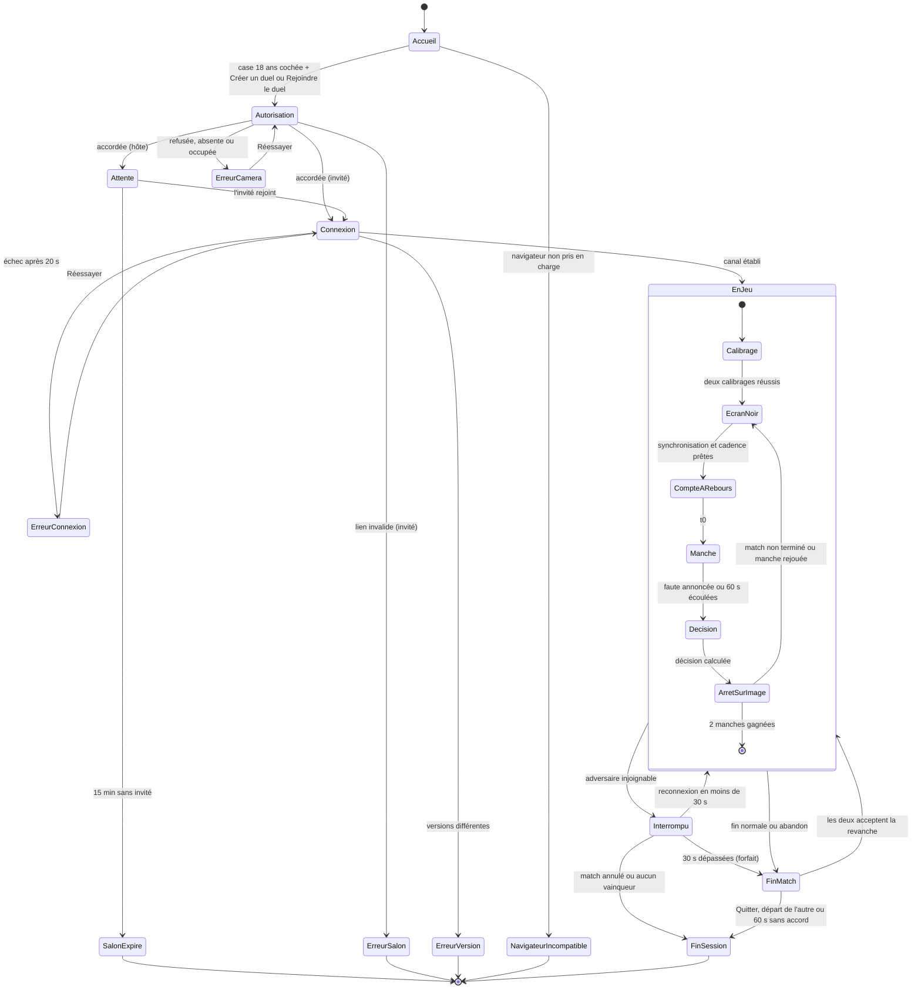

# D2 — Règles du jeu et d'arbitrage

| Champ | Valeur |
|---|---|
| Objet | Fixer les règles d'arbitrage et leurs réglages, assez précisément pour les coder sans interprétation |
| Statut | Brouillon — complet : arbitrage (lots 2 et 3) et déroulé du match (lot 4) |
| Date | 2026-09-25 |
| Dépend de | [D1](D1-note-de-cadrage.md) ; [source de cadrage](../sources/cadrage-lots-1-2-3.md) §3.4 ; [D8](D8-journal-decisions.md) n° 17 à 29, 40, 49, 56 à 72, 83 à 96, 97 à 110, 159 à 161, 169 à 172, 183 à 191 |
| Utilisé par | [D3](D3-plan-de-tests.md) (réglage des valeurs en P0) ; [D4](D4-architecture-technique.md) (messages, horloges) ; [D5](D5-parcours-maquettes.md) (écrans) ; [D7](D7-juridique-confidentialite.md) (image de preuve) |

## 1. Périmètre

- Ce document couvre l'arbitrage : calibrage, détection, jauge, visage perdu, simultanéité, départage, arrêt sur image.
- Le déroulé du match (salon, écran noir, compte à rebours, revanche, déconnexion, abandon, jauges, règles affichées) est en section 6.
- Le transport des messages et la synchronisation des horloges relèvent de [D4](D4-architecture-technique.md).
- Chaque appareil juge **son propre joueur** (n° 13). Les règles ci-dessous s'appliquent à l'identique sur les deux appareils.

## 2. Définitions

Toutes les mesures viennent de MediaPipe Face Landmarker, exécuté sur l'appareil du joueur, avec les options `outputFaceBlendshapes: true`, `outputFacialTransformationMatrixes: true` et `numFaces: 2`.

| Terme | Définition |
|---|---|
| Image analysée | Une image de la caméra passée à Face Landmarker, avec son horodatage local en millisecondes |
| Score brut `s` | Moyenne de `mouthSmileLeft` et `mouthSmileRight` (de 0 à 1). Formule de base. **À confirmer (P0)** |
| Variante du score | `s` compté seulement si la moyenne de `cheekSquintLeft` et `cheekSquintRight` dépasse un plancher. Testée en P0 à côté de la formule de base, sans la remplacer (n° 72) |
| Cadence d'analyse | Nombre d'images analysées par seconde : 15 au plus, identique sur les deux appareils, alignée sur l'appareil le plus lent, 10 au moins (5.8) |
| Intervalle d'image `i` | 1 s divisée par la cadence commune : 67 ms à 15 images/s, 100 ms à 10 images/s |
| Score lissé `S` | Moyenne mobile des scores bruts des 3 dernières images valides (200 ms à 15 images/s) |
| Neutre `n` | Médiane de `S` pendant la phase neutre du calibrage (R1) |
| Sourire volontaire `v` | Maximum de `S` pendant la phase sourire du calibrage (R1) |
| Seuil `d` | Seuil propre au joueur : `d = min(k × (v − n), d_max)`. Une image est souriante au-dessus de `n + d`, soit `n + k × (v − n)` hors plafond |
| Marge `m` | Écart au-dessus du neutre en dessous duquel le joueur est « neutre » |
| Image valide | Exactement un visage détecté, dont la largeur et les angles respectent les réglages (section 3) |
| Image souriante | Image valide avec `S ≥ n + d` |
| Image de doute | Image valide avec `n + m < S < n + d` |
| Jauge `J` | `J = min(1, max(0, (S − n − m) / (d − m)))`, affichée en pourcentage |
| t0 | Signal de révélation de la manche. Tous les temps de manche sont comptés depuis t0 |
| Aller-retour minimal `a_min` | Le plus petit des 5 allers-retours mesurés avant chaque révélation ([D4](D4-architecture-technique.md) §5.1) |
| Erreur d'horloge `e` | Borne garantie de l'erreur sur le décalage entre les horloges : `e = a_min / 2`. Un seul échantillon est retenu : celui de `a_min` (n° 160) |
| Fenêtre effective `W` | `W = max(100 ms, e + i)` (n° 161) |
| Faute | Sourire confirmé (R2) ou deuxième perte de visage (R4). La première faute fait perdre la manche |
| Aucun enregistrement | Aucun stockage persistant, nulle part : ni disque, ni stockage du navigateur, ni serveur. La mémoire vive est permise (n° 69) |

Angles : lacet (tête tournée) et tangage (tête penchée), calculés depuis la matrice de transformation du visage.
Largeur du visage : écart horizontal entre les repères extrêmes, rapporté à la largeur de l'image.

## 3. Tableau des réglages

Toutes les valeurs sont modifiables après les tests. « Hypothèse » : valeur de départ choisie pour être testée, pas mesurée. « Simulé » : valeur de départ issue d'une simulation du signal MediaPipe (n° 83 à 93), pas d'une mesure.

| Nom | Valeur de départ | Unité | Rôle | Origine | Validé par |
|---|---|---|---|---|---|
| Durée de la phase neutre | 3 | s | Mesure du neutre `n` (médiane de `S`) | Source ; simulation (n° 90) | Simulé, **à confirmer (P0)** |
| Durée de la phase sourire | 2 | s | Mesure du sourire volontaire `v` (maximum de `S`) | Valentin (n° 64) ; simulation (n° 91) | Simulé, **à confirmer (P0)** |
| Présence minimale au calibrage | 90 | % des images, par phase | Rejette un calibrage où le visage sort du champ | Hypothèse | **À confirmer (P0)** |
| Largeur minimale du visage | 20 | % de la largeur de l'image | Rejette un visage trop loin ; image invalide en manche | Hypothèse | **À confirmer (P0)** |
| Lacet maximal | 25 | degrés | Au-delà, image invalide (tête tournée) | Hypothèse | **À confirmer (P0)** |
| Tangage maximal | 20 | degrés | Au-delà, image invalide (tête penchée) | Hypothèse | **À confirmer (P0)** |
| Luminance minimale du visage | 60 | niveau sur 255 | Rejette un calibrage trop sombre | Hypothèse | **À confirmer (P0)** |
| Écart-type maximal en phase neutre | 0,05 | score | Rejette un neutre où le visage bouge ou sourit | Hypothèse | **À confirmer (P0)** |
| Plafond du neutre | 0,35 | score | Rejette un neutre trop haut | Hypothèse | **À confirmer (P0)** |
| Amplitude minimale `v − n` | 0,15 | score | Rejette un sourire volontaire trop faible | Hypothèse | **À confirmer (P0)** |
| Coefficient `k` | 0,4 | sans unité | Place le seuil à 40 % du chemin entre neutre et sourire volontaire | Simulation (n° 83) | Simulé, **à confirmer (P0)** |
| Seuil maximal `d_max` | 0,35 | score | Empêche de gonfler son seuil en exagérant le sourire volontaire (5.2) | Valentin (n° 183) | **À confirmer (P0)** |
| Plancher de la variante `cheekSquint` | 0,20 | score | Variante du score testée en P0 | Hypothèse | **À confirmer (P0)** |
| Cadence d'analyse maximale | 15 | images/s | Plafond commun aux deux appareils ; une cadence différente biaise « qui a souri en premier » | Simulation (n° 86) | Simulé, **à confirmer (P0)** |
| Cadence d'analyse minimale | 10 | images/s | Plancher de la cadence commune | Valentin (n° 94) | **À confirmer (P0)** |
| Fenêtre de lissage | 3 | images | Moyenne mobile pour `S` ; évite qu'une image bruitée compte | Simulation (n° 87) | Simulé, **à confirmer (P0)** |
| Marge `m` | 0,05 | score | Frontière neutre / zone de doute | Hypothèse | **À confirmer (P0)** |
| Durée de maintien | 500 | ms | Durée minimale d'un sourire confirmé | Simulation (n° 84), modifie la source | Simulé, **à confirmer (P0)** |
| Images minimales par sourire | 3 | images | Évite de confirmer sur deux images espacées | Hypothèse | **À confirmer (P0)** |
| Images tolérées dans une série | 1 | image | Une image non souriante isolée n'interrompt pas la série | Hypothèse | **À confirmer (P0)** |
| Délai de visage perdu | 1,5 | s | Au-delà, perte comptée | Source ; inchangé par la simulation (n° 92) | Simulé, **à confirmer (P0)** |
| Perte continue maximale | 5 | s | Au-delà, la perte compte comme deuxième perte | Valentin (n° 65) | **À confirmer (P0)** |
| Pertes avant manche perdue | 2 | pertes par manche | La deuxième perte est une faute | Source | **À confirmer (P0)** |
| Fenêtre de simultanéité minimale | 100 | ms | Plancher de sécurité de `W` | Simulation (n° 88), modifie la source ; gardé par n° 161 | Simulé, **à confirmer (P2)** |
| Multiplicateur de l'erreur d'horloge | 1 | sans unité | `W = max(100 ms, e + i)` | Valentin (n° 161), modifie n° 95 | **À confirmer (P1)** |
| Allers-retours de synchronisation | 5 | allers-retours par révélation | Estimation du décalage des horloges ; un seul échantillon retenu, celui du plus petit aller-retour ; `e = a_min / 2` | Simulation (n° 89) ; Valentin (n° 160) | Simulé, **à confirmer (P1)** |
| Durée de la manche | 60 | s | Départage au-delà | Source ; inchangée par la simulation (n° 93) | Simulé, **à confirmer (P2)** |
| Écart de pics pour égalité | 0,05 | jauge (0 à 1) | Départage : pics plus proches = manche nulle | Valentin (n° 68) | **À confirmer (P2)** |

## 4. Règles d'arbitrage

Colonnes des tableaux de cas limites : le cas, puis le comportement attendu de l'application. « Rien de particulier » signifie que la règle s'applique telle quelle.

### 4.1 R1 — Calibrage

1. Le calibrage a lieu une fois par match, avant la première manche (n° 18, confirmé par n° 71).
2. **Phase neutre** : le joueur regarde la caméra, visage neutre, pendant 3 s.
3. **Phase sourire** : le joueur sourit franchement pendant 2 s. `v` est le maximum de `S` sur la phase. On vise haut : selon la simulation, sous-estimer `v` coûte environ 20 fois plus de faux positifs que le surestimer (n° 91).
4. Le calibrage est rejeté si une seule de ces conditions est vraie :
   - moins de 90 % d'images valides dans l'une des phases ;
   - largeur médiane du visage sous 20 % ;
   - lacet ou tangage médian au-delà des limites ;
   - luminance moyenne de la zone du visage sous 60/255 (calculée sur les pixels de l'image, pas par MediaPipe) ;
   - écart-type du score brut au-dessus de 0,05 en phase neutre ;
   - neutre `n` au-dessus de 0,35 ;
   - amplitude `v − n` sous 0,15.
5. En cas de rejet, l'application affiche la **première** cause rencontrée, dans l'ordre ci-dessus, et fait recommencer les deux phases. Le nombre d'essais n'est pas limité.
6. En cas de succès, l'appareil garde `n` et calcule `d = min(0,4 × (v − n), 0,35)`. La manche ne peut pas démarrer tant que les deux joueurs n'ont pas réussi leur calibrage.
7. Si le seuil est plafonné par `d_max`, rien n'est affiché au joueur. Le plafonnement est noté pour l'analyse des tests P0.

| Cas | Comportement attendu |
|---|---|
| Parole | En phase neutre, l'écart-type dépasse 0,05 : rejet, message « Restez silencieux et immobile ». En phase sourire, rien de particulier. |
| Bâillement | En phase neutre, même effet que la parole : rejet. |
| Rire sans sourire | Rien de particulier. |
| Lunettes | Calibrer avec les lunettes portées pendant le jeu. Un reflet qui empêche la détection fait baisser la présence : rejet pour cause de présence. |
| Barbe | L'amplitude mesurée est plus faible, mais le seuil propre au joueur s'y adapte. Si `v − n < 0,15` : rejet, message « Souriez franchement ». |
| Deux visages | Images invalides. Si elles dépassent 10 % d'une phase : rejet, message « Un seul visage dans le champ ». |
| Caméra coupée | Aucune image : rejet pour cause de présence. |

### 4.2 R2 — Détection du sourire

1. Une série commence à la première image souriante dont l'horodatage est ≥ t0.
2. La série continue tant que les images sont souriantes. Une seule image non souriante (doute, neutre ou invalide) est tolérée par série, à condition que l'image suivante soit souriante. Sinon, la série s'arrête et rien n'est compté.
3. Le sourire est **confirmé** dès que la série couvre au moins 500 ms (entre sa première et sa dernière image souriante) et contient au moins 3 images souriantes.
4. L'horodatage du sourire est celui de la **première image** de la série, pas celui de la confirmation : horodatage rétroactif (n° 85).
5. Un sourire confirmé est une faute. Il ne compte que si son horodatage est dans [t0 ; t0 + 60 s[ (voir R6).
6. L'analyse continue pendant l'écran noir et le compte à rebours, pour que `S` soit déjà calculé à t0. Les images antérieures à t0 ne comptent pas pour les fautes.
7. En P0 seulement, la variante `cheekSquint` est calculée en parallèle et journalisée. Elle ne décide rien en jeu (n° 72).

| Cas | Comportement attendu |
|---|---|
| Parole | Autorisée (n° 8). Les syllabes brèves ne tiennent pas 500 ms : pas de faute. Selon la simulation, 0,5 faux positif par 20 min à 400 ms, quasi zéro à 500 ms (n° 84). Une voyelle tenue qui étire la bouche (« iii ») peut produire une faute : risque mesuré en P0 avec la variante `cheekSquint`. |
| Bâillement | Aucune exception. Si `S` dépasse le seuil 500 ms, c'est une faute. À mesurer en P0. |
| Rire sans sourire | Un rire sonore sans sourire visible n'est pas une faute (la détection sonore est reportée en v2, n° 34). Un rire bouche ouverte fait monter `mouthSmile` : faute normale. |
| Lunettes | Rien de particulier : le score ne dépend que de la bouche. |
| Barbe | Rien de particulier : le seuil est propre au joueur. |
| Deux visages | Images invalides : elles cassent la série (au-delà de l'image tolérée). La durée compte pour R4. |
| Caméra coupée | Aucune image : la série s'arrête. R4 s'applique. |

### 4.3 R3 — Zone de doute et jauge

1. La jauge `J` est calculée sur chaque image valide ≥ t0 et envoyée à l'adversaire pour affichage (les deux jauges sont visibles, n° 9).
2. La zone de doute ne donne aucune pénalité (n° 20). Seule R2 crée une faute de sourire.
3. L'appareil garde le **pic** de `J` de la manche : sa valeur maximale depuis t0 (n° 49). Le pic sert au départage (R6).
4. Sur une image invalide, `J` n'est pas recalculée : la dernière valeur reste affichée et le pic ne change pas.
5. Le pic est remis à zéro à chaque nouvelle manche, y compris une manche rejouée.

| Cas | Comportement attendu |
|---|---|
| Parole | La jauge bouge pendant la parole. C'est voulu : l'adversaire voit l'effort. Le pic peut monter, ce qui pèse au départage (voir 5.5). |
| Bâillement | La jauge peut monter. Aucune pénalité. |
| Rire sans sourire | La jauge reste basse. |
| Lunettes | Rien de particulier. |
| Barbe | Rien de particulier : la jauge est normalisée par le seuil propre au joueur. |
| Deux visages | Images invalides : jauge figée. |
| Caméra coupée | Jauge figée à sa dernière valeur. |

### 4.4 R4 — Visage perdu

1. Une **perte** commence à la première image invalide ou, si aucune image n'arrive, à la dernière image reçue. Une image est invalide si aucun visage n'est détecté, si deux visages sont détectés, si le visage est trop petit ou si ses angles dépassent les limites.
2. La perte se termine à la première image valide.
3. Une perte est **comptée** quand elle dure plus de 1,5 s. À ce moment :
   - première perte comptée de la manche : avertissement affiché aux deux joueurs ;
   - deuxième perte comptée de la manche : faute, horodatée au début de la perte + 1,5 s.
4. Une perte continue qui dure plus de 5 s compte comme deuxième perte, même si c'est la première de la manche (n° 65). Faute horodatée au début de la perte + 5 s.
5. Le compteur de pertes est remis à zéro à chaque manche.
6. Les pertes ne comptent qu'après t0. Une perte en cours à t0 commence à t0.

| Cas | Comportement attendu |
|---|---|
| Parole | Rien de particulier. |
| Bâillement | Une main devant la bouche ne fait souvent pas perdre le visage : MediaPipe continue d'estimer la bouche. Limite acceptée en v1 (5.4). Un bâillement tête en arrière dépasse le tangage : perte si plus de 1,5 s. |
| Rire sans sourire | Se cacher le visage pour rire : perte si plus de 1,5 s, faute si plus de 5 s. Se plier de rire hors du champ : idem. |
| Lunettes | Un reflet fort peut faire perdre le visage : la règle s'applique sans exception. |
| Barbe | Rien de particulier. |
| Deux visages | Images invalides (n° 67) : une personne qui passe derrière le joueur plus de 1,5 s déclenche une perte. Cela empêche aussi de se faire remplacer. |
| Caméra coupée | Coupure, permission retirée, appareil en veille ou analyse bloquée : plus aucune image, donc perte. Faute après 5 s au plus. Pas d'exception pour une cause technique. |

### 4.5 R5 — Horodatage et simultanéité

1. Avant chaque révélation, les deux appareils estiment le décalage de leurs horloges par 5 allers-retours. Un seul échantillon est retenu : celui du plus petit aller-retour `a_min`. L'erreur est bornée par `e = a_min / 2` (n° 89, n° 160). Ils mesurent aussi la cadence de chacun et fixent la cadence commune (5.8). Ils en déduisent la fenêtre effective `W = max(100 ms, e + i)`, identique sur les deux appareils (n° 88, n° 161). Le détail des messages relève de [D4](D4-architecture-technique.md). **À confirmer (P1)**
2. Chaque faute est horodatée localement, en temps de manche (ms depuis t0 sur cet appareil, corrigé du décalage estimé).
3. La première faute d'un appareil, d'horodatage T, est annoncée à l'autre appareil.
4. Chaque appareil déclare ensuite son statut jusqu'à T + W :
   - soit sa propre première faute, avec son horodatage ;
   - soit « aucune faute commencée avant T + W ». Il ne peut le déclarer qu'une fois son horloge au-delà de T + W + 500 ms + un intervalle d'image, car une série commencée avant T + W peut encore être confirmée.
5. Décision, calculée à l'identique sur les deux appareils :
   - une seule faute, ou deux fautes séparées d'au moins `W` : perd le joueur dont la faute est la plus ancienne ;
   - deux fautes séparées de moins de `W` : manche nulle, rejouée (n° 23). Pertes et pics sont remis à zéro. `W` est recalculée avant la nouvelle révélation.
6. La règle vaut pour toute faute : sourire (R2) ou perte (R4).

| Cas | Comportement attendu |
|---|---|
| Parole | Rien de particulier. |
| Bâillement | Rien de particulier. |
| Rire sans sourire | Rien de particulier. |
| Lunettes | Rien de particulier. |
| Barbe | Rien de particulier. |
| Deux visages | Une faute par perte due à deux visages est une faute comme une autre, horodatée selon R4. |
| Caméra coupée | L'appareil du joueur privé de caméra peut encore déclarer son statut : sa perte est une faute horodatée. Si l'appareil lui-même ne répond plus, c'est une déconnexion : voir 6.4. |

### 4.6 R6 — Départage à 60 s

1. Si aucune faute n'a d'horodatage dans [t0 ; t0 + 60 s[, la manche se joue au départage.
2. La décision attend la fin de R5 : une série commencée avant 60 s peut encore être confirmée jusqu'à 60 s + 500 ms environ.
3. Chaque appareil envoie le pic de jauge de son joueur (R3).
4. Perd le joueur au pic le plus haut (n° 24, n° 49).
5. Si l'écart entre les pics est inférieur à 0,05 : manche nulle, rejouée (n° 68).

| Cas | Comportement attendu |
|---|---|
| Parole | Parler fait monter la jauge : un joueur bavard risque de perdre au départage. Voir 5.5. |
| Bâillement | Un bâillement peut fixer un pic élevé. Aucune correction. |
| Rire sans sourire | Pic bas : avantage. Limite connue de la v1 (n° 34). |
| Lunettes | Rien de particulier. |
| Barbe | Rien de particulier : la jauge est normalisée par le seuil propre au joueur. |
| Deux visages | Les images invalides ne changent pas le pic. |
| Caméra coupée | Pic figé pendant la perte. Au-delà de 5 s, c'est une faute, pas un départage. |

### 4.7 R7 — Arrêt sur image

1. Quand la manche est décidée par un sourire, les deux écrans affichent une image fixe du joueur qui a souri (n° 25).
2. L'image vient de la caméra de son appareil, pas du flux reçu, qui est retardé et compressé. C'est l'image de la série (R2) où `S` est le plus haut.
3. Pour cela, chaque appareil garde en mémoire vive les images de la série en cours, et rien d'autre. Cette mémoire est vidée quand la série s'arrête.
4. L'image est transmise à l'autre appareil par le canal chiffré. Le mode de transmission relève de [D4](D4-architecture-technique.md).
5. **Aucun enregistrement** (n° 26, n° 69) : aucun stockage persistant, nulle part. L'image de preuve reste en mémoire vive sur les deux appareils et disparaît à la fin du match. Elle n'est jamais écrite sur disque, ni dans le stockage du navigateur, ni sur un serveur. À reprendre dans [D7](D7-juridique-confidentialite.md).
6. Manche perdue par visage perdu : aucune image (il n'y a pas de visage). Message « Visage perdu ».
7. Départage à 60 s : aucune image. Affichage des deux pics de jauge.
8. Manche nulle : aucune image. Message « Égalité, manche rejouée ».
9. L'arrêt sur image dure 5 s (6.7).

| Cas | Comportement attendu |
|---|---|
| Parole | L'image peut montrer une bouche en pleine syllabe : c'est l'image au score le plus haut, sans retouche. |
| Bâillement | Idem : l'image montre ce que le détecteur a jugé. |
| Rire sans sourire | Pas de faute, donc pas d'image. |
| Lunettes | Rien de particulier. |
| Barbe | Rien de particulier. |
| Deux visages | Les images invalides ne sont jamais choisies : l'image affichée ne contient qu'un visage. |
| Caméra coupée | Pas de sourire possible, donc pas d'image. Voir point 6. |

## 5. Limites de mesure et décisions associées

### 5.1 Seuil propre à chaque joueur — décidé (n° 64)

- Un seuil fixe est injuste : l'amplitude d'un sourire mesuré varie selon le visage (barbe, bouche naturellement relevée).
- Décision : calibrage en deux temps, seuil `d = k × (v − n)`, `k` = 0,4 (n° 83). La jauge devient comparable d'un joueur à l'autre.

### 5.2 Exagérer le sourire volontaire — nouveau risque

- Avec un seuil proportionnel, un joueur qui exagère son sourire volontaire relève son propre seuil. Il pourra ensuite sourire franchement sans faute.
- Parade : plafond `d_max = 0,35` (n° 183). **À confirmer (P0)** : en P0, relever la fréquence des seuils plafonnés ([D3](D3-plan-de-tests.md) §1.3.6).
- Prendre le maximum de `S` pour `v` (n° 91) rend l'exagération plus facile qu'avec une médiane : un pic bref suffit. Le plafond `d_max` devient la seule parade.
- Parades déjà en place contre un neutre truqué : plafond du neutre, écart-type maximal, amplitude minimale.

### 5.3 Perte prolongée — décidé (n° 65)

- Une perte continue de plus de 5 s est une faute. Un joueur ne peut plus échapper au jugement en sortant du champ.
- Limite acceptée : une perte d'origine technique (surchauffe, veille) est punie comme une perte volontaire. À revoir pour le mode inconnus.

### 5.4 Main devant la bouche — limite acceptée en v1 (n° 70)

- Face Landmarker estime une bouche même masquée : un sourire caché peut passer inaperçu.
- Limite acceptée en v1. Entre amis, l'adversaire voit la main.
- Dette technique : Hand Landmarker, à mesurer seulement si les tests P0 montrent que la triche par la main est fréquente.

### 5.5 Parole et départage — variante testée en P0 (n° 72)

- Certaines voyelles étirent les coins de la bouche : parler fait monter la jauge, donc le pic. Le joueur qui provoque le plus risque de perdre au départage.
- En P0, la variante `cheekSquint` est mesurée à côté de la formule de base, sans la remplacer. Le choix de la formule se fera sur les faux positifs en parlant.

### 5.6 Synchronisation des horloges — décidé (n° 66)

- La latence réseau (souvent 50 à 150 ms, asymétrique) est du même ordre que la fenêtre.
- Décision : 5 allers-retours avant chaque révélation ; un seul échantillon retenu, celui du plus petit aller-retour `a_min` ; `e = a_min / 2` ; `W = max(100 ms, e + i)` (n° 88, n° 89, n° 160, n° 161). **À confirmer (P1)**
- `e = a_min / 2` est une **borne garantie** : l'erreur réelle sur le décalage ne peut pas la dépasser, quelle que soit l'asymétrie du réseau. Elle est plus large que l'estimation de la simulation (24 ms au 95e centile, n° 89).
- Chaque horodatage n'est connu qu'à un intervalle d'image près (67 ms à 15 images/s). L'intervalle `i` est donc ajouté à la fenêtre : on ne désigne pas de perdant sur un écart que la cadence ne permet pas de mesurer (n° 95).
- Le plancher de 100 ms reste une sécurité (n° 161). Il ne joue qu'à 15 images/s, quand `a_min` est sous 66 ms, donc sur les bons réseaux. À 10 images/s, `e + i` dépasse toujours 100 ms.

Valeurs attendues de `W`. Les allers-retours sont des exemples, pas des mesures. **À confirmer (P1)**

| Réseau (exemple) | `a_min` | `e` | `W` à 15 images/s (`i` = 67 ms) | `W` à 10 images/s (`i` = 100 ms) |
|---|---|---|---|---|
| Même Wi-Fi | 20 ms | 10 ms | 100 ms (plancher ; `e + i` = 77 ms) | 110 ms |
| Wi-Fi, deux domiciles | 60 ms | 30 ms | 100 ms (plancher ; `e + i` = 97 ms) | 130 ms |
| 4G | 200 ms | 100 ms | 167 ms | 200 ms |
| 4G lente ou relayée | 340 ms | 170 ms | 237 ms | 270 ms |

- `W` réel attendu : de 100 ms à environ 270 ms selon le réseau et la cadence.
- En P1, le test du flash commun compare cette borne à l'erreur réellement mesurée : critère C3 de [D3](D3-plan-de-tests.md) §2.6 (écart mesuré ≤ `e + i`).

### 5.7 Deux visages dans le champ — décidé (n° 67)

- MediaPipe ne reconnaît pas les personnes. Deux visages = image invalide : c'est plus simple et cela empêche de se faire remplacer.

### 5.8 Cadence d'analyse commune — décidé (n° 86, n° 94)

- Un appareil qui analyse plus d'images par seconde confirme une série plus tôt et la date plus finement : les cadences différentes biaisent « qui a souri en premier ».
- Décision : cadence plafonnée à 15 images/s, identique sur les deux appareils. Les images en surplus ne sont pas analysées.
- Avant chaque révélation, chaque appareil mesure sa cadence. Les deux s'alignent sur la plus basse, avec un plancher de 10 images/s (n° 94).
- Appareil sous 10 images/s avant la révélation : la manche ne démarre pas, message « Appareil trop lent », nouvelle mesure toutes les 5 s (T14, n° 107, n° 184). Pendant la manche : la manche continue ; la cadence est réévaluée à la révélation suivante. **À confirmer (P0)**

### 5.9 Arbitre sévère — dette produit (n° 84)

- Passer le maintien de 400 à 500 ms supprime presque les faux positifs dus à la parole. Coût : la moitié des sourires réprimés de 250 ms ne sont plus détectés.
- Dette produit : option « arbitre sévère » à 400 ms. Non prévue en v1.

## 6. Déroulé du match

Les choix du lot 4, pris d'abord sans arbitrage, ont été validés par Valentin le 2026-09-25 (n° 159, 183 à 191). Les durées restent **à confirmer** par le prototype indiqué. Seul le délai de grisé de la jauge adverse (6.6, règle 4) reste une **hypothèse à valider** : aucune question ne l'a couvert.

### 6.1 Vocabulaire

| Terme | Définition |
|---|---|
| Session | Tout ce qui se passe dans un salon, du premier match à la dernière revanche |
| Match | Suite de manches jusqu'à 2 manches gagnées par un joueur **À confirmer (P2)** |
| Manche | De la révélation t0 à la décision (faute, départage ou manche nulle) |
| Salon | Lieu de rendez-vous des deux joueurs, désigné par un code aléatoire dans le lien d'invitation (n° 28) |
| Hôte | Joueur qui crée le salon et partage le lien |
| Invité | Joueur qui ouvre le lien |
| Canal | Connexion pair à pair entre les deux appareils : vidéo, audio et messages ([D4](D4-architecture-technique.md)) |
| Adversaire injoignable | Aucun message reçu de l'autre appareil depuis 3 s **À confirmer (P1)** |

Hôte et invité ont les mêmes règles. Seuls l'accueil et l'attente diffèrent.

### 6.2 Machine à états

Chaque appareil tient sa propre copie de l'état. Les deux copies avancent ensemble grâce aux messages du canal ([D4](D4-architecture-technique.md)). Les états Accueil, Navigateur incompatible, Autorisation et Erreur sont propres à chaque appareil ; les autres sont partagés.

États :

| État | Rôle | Durée |
|---|---|---|
| Accueil | Explication avant la caméra, règles (6.8), case « j'ai 18 ans ou plus » (n° 29) | Libre |
| Navigateur incompatible | Le navigateur ne permet pas de jouer (caméra, WebRTC ou détection indisponibles) ; vérifié à l'ouverture, avant la case d'âge ([D5](D5-parcours-maquettes.md) ER8) | Libre (fin) |
| Autorisation | Demande d'accès caméra et micro par le navigateur | Libre |
| Attente | L'hôte voit son image et le lien à partager | 15 min au plus **À confirmer (P2)** |
| Connexion | Établissement du canal ([D4](D4-architecture-technique.md)) | 20 s au plus **À confirmer (P1)** |
| Calibrage | R1, sur chaque appareil, une fois par match (n° 71) | Libre (essais illimités) |
| Écran noir | Écran noir ; synchronisation des horloges et mesure de la cadence (R5, 5.8) | 2 s au moins **À confirmer (P1)** |
| Compte à rebours | 3, 2, 1, puis révélation simultanée (n° 17) | 3 s |
| Manche | Jeu ; R2 à R4 | 60 s au plus **À confirmer (P2)** |
| Décision | Attente des déclarations de R5 ; la vidéo continue, rien n'est annoncé | Moins de 1 s |
| Arrêt sur image | R7 ; score du match | 5 s **À confirmer (P2)** |
| Fin de match | Vainqueur, score, revanche | 60 s au plus pour la revanche **À confirmer (P2)** |
| Interrompu | Adversaire injoignable ; attente de reconnexion | 30 s au plus **À confirmer (P1)** |
| Fin de session | Le salon expire | — |
| Erreurs | Caméra refusée, absente ou occupée ; connexion impossible ; versions différentes ; salon introuvable ou complet ; appareil trop lent | Libre |

### 6.3 Tableau des transitions

« A » désigne le joueur à l'origine de l'événement, « B » l'autre joueur. Quand l'événement concerne les deux, une seule colonne est remplie.

| N° | État | Événement | État suivant | Ce que voit A | Ce que voit B |
|---|---|---|---|---|---|
| T1 | — | Ouverture de l'application (hôte) ou du lien (invité), navigateur compatible | Accueil | Explication, règles, case d'âge ; bouton « Créer un duel » (hôte) ou « Rejoindre le duel » (invité), désactivé tant que la case n'est pas cochée | — |
| T2 | Accueil | Case cochée, « Créer un duel » ou « Rejoindre le duel » | Autorisation | Demande du navigateur : caméra et micro | — |
| T3 | Autorisation | Accès refusé, aucune caméra, ou caméra occupée par une autre application | Erreur caméra | Message d'erreur et marche à suivre ([D5](D5-parcours-maquettes.md) ER1, ER2, ER12) | — |
| T4 | Autorisation | Accès accordé, A est l'hôte | Attente | Son image, le lien, bouton « Partager » | — |
| T5 | Autorisation | Accès accordé, A est l'invité ; salon ouvert et libre | Connexion | « Connexion à votre adversaire… » | « Votre adversaire arrive… » |
| T6 | Autorisation | Accès accordé, A est l'invité ; salon introuvable, expiré ou complet | Erreur salon | « Ce lien n'est plus valable » | — |
| T7 | Attente | 15 min sans invité | Salon expiré | « Personne n'a rejoint. Le lien a expiré. » ; bouton « Créer un nouveau duel » | — |
| T8 | Connexion | Canal établi | Calibrage | Les deux : l'image de l'adversaire apparaît ; consignes de calibrage | |
| T9 | Connexion | Échec après 20 s | Erreur connexion | Les deux : « Impossible de joindre votre adversaire » ; « Réessayer » | |
| T10 | Calibrage | A réussit son calibrage, B pas encore | Calibrage | « En attente de votre adversaire… » | Sa propre consigne ; mention « Votre adversaire est prêt » |
| T11 | Calibrage | A échoue (R1) | Calibrage | Cause du rejet ; nouvel essai | « Votre adversaire recommence son calibrage » |
| T12 | Calibrage ou Arrêt sur image | Deux calibrages réussis, ou fin de l'arrêt sur image sans fin de match | Écran noir | Les deux : écran noir, « Manche N », score ; le son reste ouvert (n° 189) | |
| T13 | Écran noir | Synchronisation (5 allers-retours) faite, cadence commune ≥ 10 images/s, les deux appareils prêts, 2 s écoulées | Compte à rebours | Les deux : 3, 2, 1, calés sur le même t0 ([D4](D4-architecture-technique.md)) | |
| T14 | Écran noir | Cadence de A sous 10 images/s | Écran noir | « Appareil trop lent : fermez les autres applications » ; nouvelle mesure toutes les 5 s (n° 184) **À confirmer (P0)** | « Votre adversaire a un souci technique… » |
| T15 | Compte à rebours | t0 atteint | Manche | Les deux : révélation des deux visages, deux jauges, chronomètre 60 s | |
| T16 | Manche | Première perte comptée de A (R4) | Manche | Avertissement « Visage perdu : encore une fois et vous perdez la manche » | Mention « Visage perdu » près de l'image de A |
| T17 | Manche | Faute de A annoncée (R2 ou R4) | Décision | Rien de visible pendant moins d'une seconde | Idem |
| T18 | Manche | 60 s écoulées sans faute | Décision | Les deux : chronomètre à zéro, vidéo continue | |
| T19 | Décision | Une faute retenue (R5) ou pics séparés d'au moins 0,05 (R6) | Arrêt sur image | Perdant : image fixe de son sourire, ou « Visage perdu », ou les deux pics ; « Manche perdue » | Gagnant : la même image ou le même message ; « Manche gagnée » |
| T20 | Décision | Fautes séparées de moins de `W`, ou pics séparés de moins de 0,05 | Arrêt sur image | Les deux : « Égalité, manche rejouée » | |
| T21 | Décision | Les deux appareils calculent des décisions différentes | Arrêt sur image | Les deux : « Égalité, manche rejouée » (n° 191) | |
| T22 | Arrêt sur image | 5 s écoulées, aucun joueur à 2 manches | Écran noir | Voir T12 | |
| T23 | Arrêt sur image | 5 s écoulées, un joueur à 2 manches | Fin de match | Vainqueur : « Vous avez gagné 2–1 » | Perdant : « Vous avez perdu 1–2 » ; les deux : « Revanche » et « Quitter » |
| T24 | En jeu | A abandonne (6.5) | Fin de match | « Vous avez abandonné » | « Votre adversaire a abandonné. Victoire. » |
| T25 | En jeu | B devient injoignable | Interrompu | « Votre adversaire a perdu la connexion. Attente… 30 s » avec compte à rebours ; vidéo de B figée ou noire | Selon sa propre connexion : « Connexion perdue. Reconnexion… » |
| T26 | Interrompu | Reconnexion en moins de 30 s | En jeu, selon 6.4 | Les deux : « Reprise » | |
| T27 | Interrompu | 30 s dépassées | Fin de match (forfait) ou fin de session | Voir 6.4.3 | |
| T28 | Fin de match | A accepte la revanche, B pas encore | Fin de match | « En attente de votre adversaire… » | « Votre adversaire veut une revanche » ; bouton « Revanche » mis en avant |
| T29 | Fin de match | Les deux acceptent | Calibrage | Les deux : nouveau match, score 0–0, calibrage (n° 71, n° 185) | |
| T30 | Fin de match | A quitte | Fin de session | Retour à l'accueil | « Votre adversaire est parti » ; « Créer un nouveau duel » |
| T31 | Fin de match | 60 s sans accord des deux | Fin de session | Les deux : « Le salon a expiré » ; « Créer un nouveau duel » | |
| T32 | — | Ouverture de l'application ou du lien ; navigateur non pris en charge | Navigateur incompatible | « Ce navigateur ne permet pas de jouer » ; « Copier le lien » ([D5](D5-parcours-maquettes.md) ER8) | — |
| T33 | Connexion | Canal établi, mais versions du protocole différentes (message `bonjour`, [D4](D4-architecture-technique.md) §4.2) | Erreur version | Les deux : « Votre adversaire utilise une autre version du jeu » ; « Recharger » ([D5](D5-parcours-maquettes.md) ER9) | |

Le panneau des règles ([D5](D5-parcours-maquettes.md) E11) n'est pas un état : il se superpose à l'état en cours, dans tous les états, et ne suspend ni le chronomètre ni l'arbitrage (6.8, n° 133, n° 172).

### 6.4 Déconnexions

#### 6.4.1 Détection

- Un appareil déclare l'adversaire injoignable quand il ne reçoit plus rien de lui depuis 3 s, ou quand le canal se ferme ([D4](D4-architecture-technique.md)). **À confirmer (P1)**
- Le serveur de mise en relation sert d'arbitre de présence : il sait quel appareil lui est encore relié ([D4](D4-architecture-technique.md), n° 187). Faisabilité **à confirmer (P1)**
- Délai de reconnexion : 30 s, identique dans tous les états. **À confirmer (P1)**

#### 6.4.2 Selon l'état

| État au moment de la coupure | Pendant l'attente | Reconnexion en moins de 30 s | Au-delà de 30 s |
|---|---|---|---|
| Attente (l'hôte se coupe) | Le salon reste ouvert jusqu'à 15 min | L'hôte retrouve son salon s'il rouvre le même lien | Un invité qui arrive voit « Ce lien n'est plus valable » |
| Connexion | — | — | Erreur connexion (T9) |
| Calibrage | Le calibrage de chacun est suspendu | Le joueur coupé recommence son calibrage ; celui qui l'avait réussi le garde | Match annulé, aucun vainqueur ; fin de session ([D5](D5-parcours-maquettes.md) ER15) |
| Écran noir ou compte à rebours | Écran noir, t0 annulé | Retour à l'écran noir ; nouvelle synchronisation | Forfait du joueur coupé si au moins une manche est terminée ; sinon match annulé, fin de session ([D5](D5-parcours-maquettes.md) ER15) |
| Manche ou décision | Chronomètre arrêté ; les fautes déjà horodatées sont gardées | Voir ci-dessous | Forfait du joueur coupé |
| Arrêt sur image | La décision, déjà connue des deux, est gardée | Suite normale (T22 ou T23) | Forfait du joueur coupé, sauf si la manche décisive était déjà gagnée : fin de match normale |
| Fin de match | La revanche en attente est annulée | Retour à la fin de match | Fin de session |

Coupure pendant une manche, reconnexion en moins de 30 s :

1. Si une faute a été annoncée avant la coupure, R5 se termine avec les déclarations échangées à la reconnexion. La décision est rendue normalement.
2. Sinon, la manche est **interrompue** : ni gagnée ni perdue, rejouée depuis l'écran noir. Pertes et pics sont remis à zéro (n° 186).
3. Garde-fou : la deuxième manche interrompue par une coupure du même joueur dans le match est perdue par ce joueur. Couper son réseau ne doit pas permettre d'échapper à un sourire (n° 186).

#### 6.4.3 Forfait

- Au-delà de 30 s, le forfait est déclaré contre le joueur que le serveur ne voit plus (n° 187). **À confirmer (P1)**
- Le joueur resté relié au serveur voit : « Votre adversaire n'est pas revenu. Victoire par forfait. » Le score affiché est celui du moment de la coupure.
- Le joueur coupé, s'il revient après 30 s, voit : « Match perdu par forfait. » ; bouton « Créer un nouveau duel ».
- Si aucun des deux appareils n'est relié au serveur, aucun vainqueur n'est désigné. Chacun voit : « Connexion perdue. Match interrompu. »
- Un forfait avant qu'une manche soit terminée donne un match annulé, pas une victoire. Les deux joueurs voient l'écran de match annulé par coupure ([D5](D5-parcours-maquettes.md) ER15), puis la session se termine.
- Match annulé par **coupure** : fin de session, pas de revanche. Match annulé par **abandon** (6.5.1) : fin de match, revanche possible. Les deux cas ont des écrans distincts ([D5](D5-parcours-maquettes.md) E9 et ER15, n° 171).
- Pas de revanche après un forfait : le salon expire.

#### 6.4.4 Page masquée ou appareil en veille

- Changer d'application, verrouiller l'écran ou mettre l'appareil en veille coupe la caméra : c'est une perte de visage (R4), sans exception (5.3). Faute après 5 s au plus.
- Si le canal tombe aussi, les règles de déconnexion s'appliquent en plus.
- Hors manche (calibrage, écran noir, compte à rebours), un appareil dont la page est masquée n'est pas prêt : la révélation attend.

### 6.5 Abandon volontaire et revanche

#### 6.5.1 Abandon

1. Un bouton « Abandonner » est présent en calibrage, écran noir, compte à rebours, manche et arrêt sur image.
2. Il demande une confirmation : « Abandonner le match ? » La manche continue pendant la question : la confirmation n'arrête ni le chronomètre ni l'arbitrage.
3. Une faute commise pendant la question compte normalement.
4. Après confirmation, l'adversaire gagne le match. Si aucune manche n'est terminée, le match est annulé.
5. Les deux joueurs arrivent en fin de match. La revanche reste possible.
6. Fermer l'onglet n'est pas un abandon : c'est une coupure (6.4). « Quitter », en fin de match, prévient l'autre immédiatement.

#### 6.5.2 Revanche

1. En fin de match, chaque joueur voit « Revanche » et « Quitter ».
2. La revanche démarre quand les deux l'ont acceptée, dans les 60 s qui suivent la fin du match. **À confirmer (P2)**
3. Nouveau match : score à 0–0, nouveau calibrage (n° 71, n° 185), même salon, même canal. Le recalibrage sera revu si les testeurs de P2 s'en plaignent.
4. Le nombre de revanches n'est pas limité.
5. Une revanche est « spontanée » (n° 40) si les deux joueurs l'acceptent sans qu'on le leur demande. Sa mesure relève de [D3](D3-plan-de-tests.md).

#### 6.5.3 Salon et revanche

- La source disait que le salon expire « à la fin du match » (n° 28). Pris à la lettre, cela interdisait la revanche et la reconnexion.
- Décision (n° 159) : le salon se **verrouille** dès que l'invité arrive (personne d'autre ne peut entrer). Il reste ouvert pour la reconnexion et la revanche. Il expire à la **fin de la session** : départ d'un joueur, forfait, match annulé par coupure, ou 60 s sans revanche.

### 6.6 Comportement des jauges

| Moment | Jauge du joueur | Jauge de l'adversaire |
|---|---|---|
| Accueil, attente, connexion | Absente | Absente |
| Calibrage | Absente ; une barre de progression par phase | Absente ; mention « prêt » ou « calibre » |
| Écran noir, compte à rebours | Cachée : l'analyse tourne mais rien ne s'affiche (R2 point 6) | Cachée |
| Manche | `J` en direct, à chaque image analysée (R3) | Dernière valeur reçue ; retard réseau accepté |
| Décision | Figée | Figée |
| Arrêt sur image | Figée ; pic affiché en cas de départage | Idem |
| Fin de match | Absente | Absente |
| Interrompu | Figée | Grisée, marquée « — » |

Règles d'affichage :

1. Les deux jauges ont la même taille et la même échelle, de 0 à 100 %.
2. 100 % signifie « au seuil de sourire », pas « faute » : une faute demande en plus 500 ms de maintien (R2). Aucun message n'est affiché quand une jauge atteint 100 %.
3. Un repère fixe montre le pic de la manche sur chaque jauge : le départage (R6) devient visible avant la fin (n° 190).
4. Si aucune valeur de l'adversaire n'arrive depuis 1 s pendant la manche, sa jauge est grisée jusqu'à la valeur suivante. **Hypothèse à valider, à confirmer (P1)**
5. Sur image invalide, la jauge est figée (R3 point 4) et la mention « Visage perdu » s'affiche à côté dès que la perte est comptée.
6. Pour les jauges, seules `J` et son pic circulent, jamais les scores bruts. Les autres messages échangés (événements de jeu, informations techniques, image de preuve) sont listés dans [D4](D4-architecture-technique.md) §4.2.

### 6.7 Réglages du déroulé

Complètent le tableau de la section 3. Valeurs de départ validées par Valentin le 2026-09-25 (n° 186, 188, 184), sauf la dernière ligne.

| Nom | Valeur de départ | Unité | Rôle | Validé par |
|---|---|---|---|---|
| Durée de vie d'un salon sans invité | 15 | min | Expiration du lien non utilisé | **À confirmer (P2)** |
| Délai de connexion | 20 | s | Au-delà, erreur connexion | **À confirmer (P1)** |
| Silence avant « adversaire injoignable » | 3 | s | Détection d'une coupure | **À confirmer (P1)** |
| Délai de reconnexion | 30 | s | Au-delà, forfait ou match annulé | **À confirmer (P1)** |
| Manches interrompues tolérées | 1 | par joueur et par match | La suivante est perdue | **À confirmer (P2)** |
| Durée minimale de l'écran noir | 2 | s | Temps de la synchronisation et de la mesure de cadence | **À confirmer (P1)**, information seulement ([D3](D3-plan-de-tests.md) §2.6) |
| Compte à rebours | 3 | s | 3-2-1 (source) | Source (n° 17) |
| Durée de l'arrêt sur image | 5 | s | Temps de voir la preuve | **À confirmer (P2)** |
| Délai de revanche | 60 | s | Au-delà, fin de session | **À confirmer (P2)** |
| Nouvelle mesure de cadence | 5 | s | Appareil trop lent (T14) | **À confirmer (P0)** |
| Absence de jauge avant grisé | 1 | s | Affichage de la jauge adverse | **Hypothèse à valider, à confirmer (P1)** |

### 6.8 Règles affichées aux joueurs

Texte exact, affiché à l'accueil (6.2) et accessible pendant le jeu. Les nombres suivent le tableau des réglages : si un réglage change, le texte change.

> 1. Le premier qui sourit perd la manche ; deux manches gagnées remportent le match.
> 2. Parlez, grimacez, faites rire l'autre : tout est permis.
> 3. Gardez votre visage visible et seul à l'écran, sinon vous perdez la manche.
> 4. Votre jauge monte quand vous êtes près de sourire, et votre adversaire la voit.
> 5. Si personne ne craque en 60 secondes, perd celui dont la jauge est montée le plus haut.

La règle 3 simplifie R4 (avertissement, puis faute) : l'avertissement explique le détail au moment où il survient (T16).

Pendant le jeu, les règles s'ouvrent dans un panneau ([D5](D5-parcours-maquettes.md) E11), disponible dans tous les états. Le panneau ne suspend ni le chronomètre ni l'arbitrage (n° 133, n° 172).

## 7. Questions ouvertes

Aucune. Toutes les questions de ce document ont été tranchées par Valentin le 2026-09-25 :

| N° | Réponse | Décision |
|---|---|---|
| Q1 à Q8 du premier brouillon | Voir [D8](D8-journal-decisions.md) | n° 64 à 71 |
| Q2 à Q4 des valeurs simulées | Voir [D8](D8-journal-decisions.md) | n° 94 à 96 |
| Q1 | Plafond `d_max` = 0,35, à confirmer (P0) | n° 183 |
| Q5 | Appareil sous 10 images/s : proposition retenue (5.8) | n° 184 |
| Q6 | `e = a_min / 2`, un seul échantillon ; `W = max(100 ms, e + i)` ; chiffres en 5.6 | n° 160, 161 |
| Q7 | Salon verrouillé à deux, expire à la fin de la session (6.5.3) | n° 159 |
| Q8 | Recalibrer à chaque revanche ; à revoir après P2 | n° 185 |
| Q9 | Manche interrompue rejouée, avec garde-fou | n° 186 |
| Q10 | Forfait arbitré par le serveur de mise en relation ; faisabilité en P1 | n° 187 |
| Q11 | Durées du déroulé (6.7) validées comme valeurs de départ | n° 188 |
| Q12 | Son ouvert pendant l'écran noir | n° 189 |
| Q13 | Repère du pic sur les jauges | n° 190 |
| Q14 | Décisions divergentes : manche rejouée | n° 191 |
