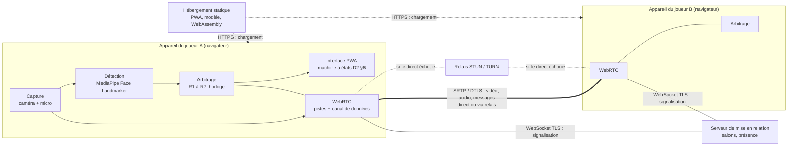

# D4 — Architecture technique

| Champ | Valeur |
|---|---|
| Objet | Dire quelles données circulent et par où, où se trouve la source de vérité de l'arbitrage, ce qui coûte, et comment ne pas fermer la porte au mode inconnus |
| Statut | Brouillon |
| Date | 2026-09-26 |
| Dépend de | [D1](D1-note-de-cadrage.md) ; [D2](D2-regles-jeu-arbitrage.md) (règles R1 à R7, machine à états §6) ; [source de cadrage](../sources/cadrage-lots-1-2-3.md) §3.2, §3.5, §4.1 ; [D8](D8-journal-decisions.md) n° 7, 11 à 14, 26 à 28, 31, 66, 86, 89, 94, 95, 97 à 110, 111 à 125, 159 à 163, 168, 174, 198 à 206 |
| Utilisé par | [D3](D3-plan-de-tests.md) (prototype 1) ; [D5](D5-parcours-maquettes.md) (mise en page, erreurs) ; [D6](D6-lots-developpement.md) (modules) ; [D7](D7-juridique-confidentialite.md) (données, services, pays) |

Aucun code applicatif dans ce document. Les exemples JSON décrivent le format des messages.

## 1. Principes

1. **L'analyse reste sur l'appareil.** Chaque appareil analyse son propre joueur (n° 13). Aucune image ni aucun score brut ne quitte l'appareil, sauf l'image de preuve (R7).
2. **La vidéo va de pair à pair.** Vidéo, audio et messages de jeu passent par une seule connexion WebRTC chiffrée (n° 12, n° 27). Le relais TURN, quand il sert, transmet sans pouvoir lire.
3. **Le serveur ne voit que la mise en relation.** Il connaît le code du salon, les adresses IP et les descriptions de connexion. Il ne voit ni vidéo, ni son, ni message de jeu.
4. **Rien n'est stocké** (n° 26, n° 69) : ni disque, ni stockage du navigateur, ni serveur, en dehors des journaux techniques des hébergeurs (section 9).
5. **Aucun tiers dans la page** : ni mesure d'audience, ni police, ni script chargé depuis un autre domaine. Le modèle MediaPipe, ses fichiers WebAssembly et la bibliothèque cliente PeerJS sont servis par l'hébergement de la PWA ; sans cela, un CDN tiers verrait l'adresse IP de chaque joueur. Les seuls tiers sont la mise en relation et le relais (section 8).

## 2. Schéma des composants



| Composant | Rôle | Où | Voit |
|---|---|---|---|
| Interface PWA | Écrans ([D5](D5-parcours-maquettes.md)), machine à états ([D2](D2-regles-jeu-arbitrage.md) §6) | Navigateur | Tout, localement |
| Capture | Un seul flux caméra + micro, partagé entre la détection et WebRTC | Navigateur | Image et son du joueur |
| Détection | Face Landmarker : repères, blendshapes, matrice de transformation, à la cadence commune | Navigateur | Image du joueur |
| Arbitrage | Calibrage, score, jauge, pertes, fautes, horloge, décision | Navigateur | Scores du joueur ; messages de l'adversaire |
| WebRTC | Pistes audio et vidéo ; un canal de données « jeu », fiable et ordonné | Navigateur | Flux chiffrés |
| Hébergement statique | Sert la PWA, le modèle et le WebAssembly | Hébergeur (section 8) | Adresse IP, fichiers demandés |
| Serveur de mise en relation | Salons, échange des descriptions de connexion, présence | Service (section 8) | Adresse IP, code du salon, candidats de connexion (adresses IP locales et publiques) |
| Relais STUN / TURN | STUN : révèle l'adresse publique. TURN : relaie les flux chiffrés quand le direct échoue | Service (section 8) | Adresse IP, volume échangé ; jamais le contenu |

Un seul flux caméra : iOS n'autorise pas deux captures de la même caméra ; le même flux alimente la détection et l'envoi vidéo.

## 3. Données qui circulent

| Donnée | De | Vers | Par | Chiffrement | Durée de vie |
|---|---|---|---|---|---|
| Fichiers de la PWA, modèle (quelques Mo), WebAssembly | Hébergement | Appareil | HTTPS | TLS | Cache du navigateur (fichiers publics, aucune donnée personnelle) |
| Code du salon | Appareil | Serveur de mise en relation | WebSocket | TLS | Jusqu'à la fin de la session, revanches comprises ([D2](D2-regles-jeu-arbitrage.md) §6.5.3, n° 159) |
| Descriptions de connexion (SDP) et candidats (adresses IP) | Appareil | Autre appareil, via le serveur | WebSocket | TLS | Le temps de la connexion |
| Adresse IP | Appareil | Hébergement, serveur, relais | — | — | Journaux des prestataires (section 9) |
| Vidéo et audio | Appareil | Autre appareil, direct ou via relais | SRTP | DTLS-SRTP, de bout en bout | Instantané, jamais stocké |
| Messages de jeu (section 4) | Appareil | Autre appareil | Canal de données | DTLS | Mémoire vive, fin du match |
| Image de preuve (R7) | Appareil du joueur qui a souri | Autre appareil | Canal de données | DTLS | Mémoire vive, fin du match (n° 69) |
| Scores bruts, neutre, sourire volontaire, seuil | — | Ne quittent pas l'appareil | — | — | Mémoire vive, fin du match |

## 4. Messages

### 4.1 Signalisation (appareil ↔ serveur de mise en relation)

Le format exact dépend du service retenu (section 8). Les échanges nécessaires :

| Message | Sens | Rôle |
|---|---|---|
| Ouvrir un salon | Hôte → serveur | Réserve un code aléatoire ; le lien contient ce code |
| Rejoindre | Invité → serveur | Demande l'hôte du code ; erreur si salon introuvable, expiré ou complet (T6) |
| Offre, réponse, candidats | Appareil → serveur → autre appareil | Établissement de la connexion WebRTC |
| Présence | Appareil → serveur | « L'autre appareil est-il encore relié ? » : arbitre du forfait (T27, n° 101) |
| Fermer | Appareil → serveur | Fin de session : le code devient invalide |

Code du salon : au moins 16 caractères aléatoires tirés par `crypto.getRandomValues`, impossibles à deviner. **Hypothèse à valider**

### 4.2 Canal de jeu (appareil ↔ appareil)

Tous les messages de jeu passent par un canal de données WebRTC fiable et ordonné. Enveloppe commune :

```json
{ "v": 1, "type": "jauge", "seq": 412, "t": 53120.4, "data": { } }
```

| Champ | Sens |
|---|---|
| `v` | Version du protocole. Deux versions différentes : état Erreur version ([D2](D2-regles-jeu-arbitrage.md) T33), écran ER9 de [D5](D5-parcours-maquettes.md) |
| `type` | Type du message (tableau ci-dessous) |
| `seq` | Numéro d'ordre, par émetteur |
| `t` | Horloge locale de l'émetteur, en ms (`performance.now()`, monotone) |
| `data` | Contenu propre au type |

| Type | Émetteur | Quand | Contenu (`data`) |
|---|---|---|---|
| `bonjour` | Les deux | Canal ouvert | Version, rôle, cadence maximale mesurée, type d'appareil |
| `battement` | Les deux | Chaque seconde | Vide. Trois secondes sans aucun message : adversaire injoignable (n° 99) |
| `calibrage` | Les deux | À chaque étape de R1 | État : `en_cours`, `reussi`, `rejete` + cause. Jamais `n`, `v` ni `d` |
| `pret` | Les deux | Écran noir | Calibré, page visible, cadence mesurée |
| `sync_ping` / `sync_pong` | Hôte / invité | Écran noir, 5 fois | Horodatages (5.1) |
| `sync_resultat` | Hôte | Après les 5 allers-retours | Décalage, erreur `e`, cadence commune, fenêtre `W`, numéro de manche, t0 |
| `jauge` | Les deux | Chaque image analysée pendant la manche | `j` (0 à 1), `pic` |
| `perte` | Les deux | Perte comptée (R4) | Numéro de la perte |
| `faute` | Les deux | Première faute de la manche | Type, horodatage en temps de manche |
| `statut` | Les deux | R5 point 4 | Faute ou « aucune faute avant T + W » |
| `pic_final` | Les deux | Départage (R6) | Pic de la manche |
| `decision` | Les deux | Décision calculée | Résultat, empreinte des entrées (6.3) |
| `preuve` | Joueur qui a souri | Après la décision | Morceaux d'une image JPEG (4.3) |
| `abandon`, `revanche`, `quitter` | Les deux | Action du joueur | Vide ou `accepte` |

Exemples :

```json
{ "v": 1, "type": "bonjour", "seq": 0, "t": 1520.0,
  "data": { "role": "hote", "cadence_max": 24, "appareil": "telephone" } }
```

```json
{ "v": 1, "type": "sync_ping", "seq": 18, "t": 20100.0,
  "data": { "t1": 20100.0 } }
{ "v": 1, "type": "sync_pong", "seq": 9, "t": 8411.3,
  "data": { "t1": 20100.0, "t2": 8410.9, "t3": 8411.2 } }
```

```json
{ "v": 1, "type": "sync_resultat", "seq": 24, "t": 20745.0,
  "data": { "manche": 2, "decalage": -11693.6, "e": 21.0,
            "cadence": 12, "w": 104, "t0_hote": 25800.0 } }
```

```json
{ "v": 1, "type": "jauge", "seq": 412, "t": 53120.4,
  "data": { "j": 0.42, "pic": 0.57 } }
```

```json
{ "v": 1, "type": "faute", "seq": 530, "t": 61340.2,
  "data": { "manche": 2, "genre": "sourire", "tm": 35540 } }
```

```json
{ "v": 1, "type": "statut", "seq": 548, "t": 62270.0,
  "data": { "manche": 2, "jusqua_tm": 35644, "faute_tm": null } }
```

```json
{ "v": 1, "type": "decision", "seq": 549, "t": 62280.0,
  "data": { "manche": 2, "resultat": "perd_hote", "cause": "sourire",
            "empreinte": "35540|null|104" } }
```

`tm` : temps de manche, en ms depuis t0, sur l'horloge de l'hôte (5.1). Dans l'exemple, `e` = 21 ms (plus petit aller-retour de 42 ms) et la cadence de 12 images/s donne `i` = 83 ms : `W = max(100, 21 + 83)` = 104 ms.

### 4.3 Image de preuve

- Image JPEG de la caméra locale, réduite à 480 pixels de large, qualité 0,7 : environ 30 à 60 Ko. **Hypothèse à valider, à confirmer (P2)**
- Envoyée en morceaux de 16 Ko sur le canal de jeu, précédés d'un message `preuve` qui annonce le nombre de morceaux. 16 Ko est la taille de message sûre entre navigateurs.
- Gardée en mémoire vive (objet `Blob`), jamais écrite dans un stockage. Libérée à la fin du match (n° 69).
- Si elle n'est pas arrivée à la fin de l'arrêt sur image : message « Image indisponible », la décision reste valable.

## 5. Horloges et cadence

### 5.1 Synchronisation des horloges

Pendant l'écran noir de chaque manche ([D2](D2-regles-jeu-arbitrage.md) R5, n° 89). L'hôte mène l'échange ; l'invité répond.

1. L'hôte envoie `sync_ping` avec son heure `t1`.
2. L'invité note l'heure de réception `t2` et l'heure de réponse `t3`, et renvoie `sync_pong`.
3. L'hôte note l'heure de réception `t4`.
4. Aller-retour `a = (t4 − t1) − (t3 − t2)` ; décalage `θ = ((t2 − t1) + (t3 − t4)) / 2`.
5. Cinq échanges, espacés de 100 ms. Un seul échantillon est retenu : celui du plus petit aller-retour `a_min`. Son décalage θ sert pour la manche (n° 160).
6. Erreur `e = a_min / 2` : borne garantie de l'erreur sur le décalage, quelle que soit l'asymétrie du réseau (n° 160). **À confirmer (P1)**
7. L'hôte calcule `W = max(100 ms, e + i)` ([D2](D2-regles-jeu-arbitrage.md) R5, n° 161) et l'envoie dans `sync_resultat` avec t0. Les deux appareils utilisent donc les mêmes `W` et t0.
8. L'invité convertit t0 dans son horloge : `t0_invité = t0_hôte + θ`.

Conséquences : avec un aller-retour de 60 ms, `e` = 30 ms et `W` = 100 ms (plancher) à 15 images/s, 130 ms à 10 images/s. Avec 200 ms en 4G, `W` = 167 ms à 15 images/s, 200 ms à 10 images/s. `W` attendu : de 100 à environ 270 ms selon le réseau et la cadence (tableau en [D2](D2-regles-jeu-arbitrage.md) §5.6). La simulation donnait une erreur réelle de 24 ms au 95e centile (n° 89) ; la borne `a_min / 2` est plus large. En P1, le test du flash commun la compare à l'erreur réellement mesurée ([D3](D3-plan-de-tests.md) §2.3.3, critère C3).

Le temps écoulé depuis t0 est mesuré sur l'horloge monotone de chaque appareil, jamais sur l'heure système, qui peut sauter.

### 5.2 Cadence d'analyse

| Moment | Action |
|---|---|
| Canal ouvert (`bonjour`) | Chaque appareil annonce sa cadence maximale, mesurée pendant l'attente ou la connexion. L'hôte fixe une cadence commune provisoire : `min(15, cadence_A, cadence_B)` |
| Écran noir de chaque manche | Chaque appareil mesure sa cadence sur la dernière seconde (`pret`). L'hôte fixe la cadence commune de la manche et l'envoie dans `sync_resultat` (n° 94) |
| Cadence commune sous 10 images/s | La manche ne démarre pas ([D2](D2-regles-jeu-arbitrage.md) T14, n° 107) |
| Pendant la manche | Cadence inchangée. Si un appareil ne tient plus la cadence, il analyse moins d'images ; la cadence est revue à la manche suivante ([D2](D2-regles-jeu-arbitrage.md) §5.8, n° 184) |

Plafonnement (n° 230) : chaque image de la caméra est examinée à son arrivée. Elle n'est analysée que si deux conditions sont remplies. D'abord, son échéance est atteinte : l'échéance avance de `1000 / cadence` ms à chaque image analysée, avec une marge de 8 ms pour l'irrégularité de la caméra. Ensuite, moins de `cadence` images ont été analysées dans la dernière seconde. La cadence ne dépasse donc jamais le plafond. Contrepartie : avec une caméra irrégulière, elle peut descendre jusqu'à 1 image/s sous le plafond (14 à 15 au lieu de 15). Les images de la caméra en surplus sont ignorées par la détection, pas par la vidéo envoyée.

## 6. Source de vérité de l'arbitrage

### 6.1 Répartition

| Question | Qui fait foi |
|---|---|
| Le joueur A a-t-il fauté, et quand ? | L'appareil de A, seul (n° 13) |
| Le joueur B a-t-il fauté, et quand ? | L'appareil de B, seul |
| Qui perd la manche ? | Les deux appareils, par le même calcul sur les mêmes messages (R5, R6) |
| Horloge commune, `W`, cadence, t0 | L'hôte, qui les envoie à l'invité |
| Présence (forfait) | Le serveur de mise en relation (n° 101) |

### 6.2 Pourquoi pas un arbitre central

- Un serveur arbitre devrait recevoir les images ou les scores : contraire au principe 1 et au budget.
- Un appareil arbitre (l'hôte) donnerait un avantage à l'hôte en cas de doute. Le calcul symétrique n'en donne à personne.

### 6.3 Divergence

- Chaque appareil envoie sa décision et une empreinte de ses entrées (fautes, statuts, `W`).
- Si les deux décisions diffèrent : manche rejouée ([D2](D2-regles-jeu-arbitrage.md) T21, n° 108), et l'incident est compté dans le journal de test (P1, P2).

### 6.4 Limite acceptée en v1

- Un client modifié peut ne jamais déclarer ses fautes. Rien ne l'empêche en v1.
- Entre amis, l'adversaire voit le sourire et l'arrêt sur image manque : la triche se voit.
- Pour le mode inconnus, l'arbitrage devra être vérifié côté serveur (n° 31) : voir section 11.

## 7. Compatibilité et performances cibles

Recherche du 2026-09-25. Les renvois [Sn] désignent les sources de la section 14. « Vérifié » : lu sur la page citée. « Déduit » : conclusion de ce document.

### 7.1 Ce que disent les sources

| Sujet | Constat | Source |
|---|---|---|
| MediaPipe Face Landmarker, navigateurs | Le guide officiel demande « Chrome or Safari ». Firefox et Edge ne sont pas cités ; aucune matrice de compatibilité n'est publiée | [S1] |
| MediaPipe, version | Paquet `@mediapipe/tasks-vision` 1.0.1 (version stable) | [S2] |
| MediaPipe, calcul | Délégué `CPU` (par défaut) ou `GPU`. Le délégué GPU s'appuie sur WebGL2 ; aucune trace de WebGPU dans le paquet (déduit de la lecture du paquet) | [S1], [S2] |
| MediaPipe, poids | Modèle `face_landmarker.task` : 3,6 Mio. WebAssembly : 11,8 Mo (11 Mo sans SIMD) | [S2], [S3] |
| MediaPipe, blendshapes | `mouthSmileLeft`, `mouthSmileRight`, `cheekSquintLeft`, `cheekSquintRight` existent ; `outputFaceBlendshapes` vaut `false` par défaut | [S4], [S5] |
| MediaPipe, performance | Aucun chiffre officiel d'images par seconde sur le web. Un ancien ticket (2022, autre modèle) relevait 6 à 7 images/s sur iPhone 11 à 13 | [S4], [S6] |
| MediaPipe sur iOS | Délégué GPU défaillant sur iOS 18 pour une autre tâche (ticket ouvert) ; fuite de mémoire WebKit quand on recrée le détecteur (ticket ouvert) ; plantage au chargement depuis le cache (corrigé) | [S7], [S8], [S9] |
| MediaPipe, carte graphique contre processeur (relevés L0.2) | iPhone XR (iOS 18.7.9) : la carte graphique fonctionne, sans repli ; le défaut signalé [S7] n'apparaît pas. Mais sur les deux iPhone, le processeur est plus rapide : 34 contre 39-40 ms par image sur le XR, 20 contre 31-32 ms sur le 15 Pro. Il démarre aussi plus vite : première image en 286 contre 834 ms sur le XR. Sur le PC, la carte graphique est plus rapide (21 contre 30 ms) | Relevés L0.2 de Valentin ([D3](D3-plan-de-tests.md) §1.7.2, n° 236) |
| WebRTC, prise en charge | `RTCPeerConnection` et `getUserMedia` : Safari 11+ (iOS et macOS), Chrome, Firefox, Edge. `RTCDataChannel` : largement disponible depuis 2020. HTTPS obligatoire | [S10], [S11], [S12] |
| PeerJS | Navigateurs annoncés : Firefox 80+, Chrome 83+, Edge 83+, Safari 15+ | [S13] |
| iOS, lecture | `playsinline` obligatoire ; lecture automatique seulement si muet ou après un geste ; un flux caméra se lit automatiquement si la page capture déjà | [S14], [S15] |
| iOS, second `getUserMedia` | Coupe la piste précédente : un seul flux, cloné si besoin | [S15] |
| iOS, PWA installée | Caméra en mode installé corrigée en iOS 13.4, puis vidéo noire signalée de 16.3 à 18.5 ; permission caméra non conservée pour une PWA installée | [S16], [S17], [S18] |
| iOS, arrière-plan | Aucune source officielle ; signalements de micro ou caméra coupés. Prévoir une coupure du flux (déduit) | [S19] |
| Codecs | VP8 et H.264 obligatoires dans tous les navigateurs WebRTC. H.264 accéléré en matériel sur iOS, VP8 non | [S20], [S21] |
| Navigateur intégré de Messenger (iPhone) | Un lien ouvert depuis Messenger s'exécute dans le navigateur de l'application, pas dans Safari. Caméra et MediaPipe y fonctionnent (MediaPipe prêt en 0,4 à 0,7 s en Wi-Fi). Messenger injecte un script `connect.facebook.net/en_US/pcm.js`, bloqué par la politique de sécurité de la page | Relevé L0.1 de Valentin, 2026-09-25 ([D3](D3-plan-de-tests.md) §1.7.1, n° 228) |

### 7.2 Navigateurs cibles

| Appareil | Navigateur | Statut | À vérifier |
|---|---|---|---|
| iPhone, iPad | Safari, version 15 ou plus | Cible | P0 : cadence, délégué GPU ou CPU, chauffe. P1 : lecture, arrière-plan |
| iPhone | Chrome ou Firefox pour iOS (moteur WebKit) | À tester | P1 : accès caméra non confirmé par les sources ; aucun iPhone de test ne l'utilise par défaut |
| Android | Chrome récent | Cible | Android à emprunter ; sinon « à tester » jusqu'au premier joueur Android de P2 (n° 218) |
| Ordinateur | Chrome, Edge récents | Cible | P0 : PC portable Windows 11 de référence haute ([D3](D3-plan-de-tests.md) §1.2.3) |
| Ordinateur | Safari macOS 15 ou plus | Cible | Aucun Mac de test |
| Ordinateur | Firefox récent | À tester | P0 : non cité par MediaPipe |
| Tous | PWA installée sur l'écran d'accueil | Non proposée en v1 sur iOS (n° 202) | Bogues caméra en mode installé [S16] à [S18] |

- Les navigateurs « à tester » deviennent cibles seulement s'ils passent le critère G3 en P0 et les essais de P1 (n° 203). D'ici là, le message de navigateur incompatible recommande seulement Chrome ou Safari ([D5](D5-parcours-maquettes.md) ER8, n° 174).
- Navigateurs intégrés des messageries (lien ouvert dans Messenger, WhatsApp, Instagram…) : c'est ainsi que les invitations seront ouvertes en pratique. L'hypothèse de départ les classait hors cible, avec l'écran ER8 et une invitation à ouvrir le lien ailleurs. Elle est **partiellement validée** pour Messenger sur iPhone : la page y fonctionne, caméra et MediaPipe compris (n° 228). Les renvoyer vers ER8 bloquerait donc des joueurs sans raison. WhatsApp et Instagram, ainsi que l'appel vidéo dans ces navigateurs, sont testés en P1 ([D3](D3-plan-de-tests.md) §2.3.7, n° 229). Le traitement à l'accueil (bloquer, proposer « Ouvrir dans Safari », ou laisser jouer) reste ouvert ([D5](D5-parcours-maquettes.md) Q8). **À confirmer (P1)**

### 7.3 Choix qui en découlent

| Choix | Raison |
|---|---|
| Détecteur créé une seule fois par session, jamais recréé | Fuite de mémoire WebKit [S8] |
| Mode de calcul par famille d'appareil : processeur sur iOS, carte graphique ailleurs, avec un seul repli sur le processeur ; `?calcul=` pour forcer un mode ; mode affiché et journalisé (n° 232, n° 241) | Défaillances GPU possibles sur iOS [S7] ; RT1 |
| Un seul flux caméra et micro, partagé entre détection et envoi | [S15] |
| Vidéo envoyée en H.264 quand un appareil iOS est dans le duel (n° 205) **À confirmer (P1)** | Économie de processeur, partagé avec MediaPipe [S21] |
| Fichiers MediaPipe servis par l'hébergement de la PWA, version figée (1.0.1, n° 220) | Pas de CDN tiers (principe 5) ; RT12 |
| Politique de sécurité de la page : tout chargement externe bloqué, y compris les statistiques d'usage que MediaPipe envoie à Google (n° 221, n° 225) | Principe 5 vérifiable sur iPhone ; l'envoi des statistiques ne peut pas être désactivé dans la bibliothèque ; bloque aussi les scripts injectés par les navigateurs intégrés des messageries, comme celui de Messenger (n° 228). Fonctionne sur Chrome, Edge, Safari iOS 18 et 26, et dans Messenger (n° 227) |
| Modèle et WebAssembly chargés dès l'accueil, en arrière-plan | 15 Mo au premier chargement ; prêts avant le calibrage |

### 7.4 Performances cibles

| Indicateur | Cible | Validé par |
|---|---|---|
| Cadence d'analyse | Entre 10 et 15 images/s, commune aux deux appareils ([D2](D2-regles-jeu-arbitrage.md) §3) | **À confirmer (P0)** |
| Chauffe | Critère G3 de [D3](D3-plan-de-tests.md) | **À confirmer (P0)** |
| Premier chargement (lien → accueil affiché) | 3 s au plus en 4G | **À confirmer (P1)**, information seulement (n° 168) |
| Modèle prêt (lien → calibrage possible) | 15 s au plus en 4G au premier chargement | **À confirmer (P1)**, information seulement (n° 168) |
| Établissement de la connexion | 20 s au plus ([D2](D2-regles-jeu-arbitrage.md) §6.7) | **À confirmer (P1)** (critère C2) |
| Retard vidéo d'un écran à l'autre | 300 ms au plus | **À confirmer (P1)**, information seulement (n° 168) |
| Vidéo envoyée | 640 × 480, 1,7 Mbit/s au plus (plafond par défaut de libwebrtc à cette résolution [S22]) ; n° 205 | **À confirmer (P1)** (critère C5) |

« Information seulement » : la valeur est mesurée en P1 et corrige la cible, sans critère ni effet sur la décision « Go » ([D3](D3-plan-de-tests.md) §2.6).
| Image de preuve reçue | 2 s au plus après la décision | **Hypothèse à valider, à confirmer (P2)** |

## 8. Mise en relation et relais : choix des services

### 8.1 Mise en relation

| Option | Gratuit | Au-delà, en euros | Pays d'hébergement | Pour | Contre | Source |
|---|---|---|---|---|---|---|
| **PeerJS, serveur public** | Oui, sans limite publiée | Sans objet | Non publié | Déjà utilisé par Valentin ; aucun serveur à écrire ; bibliothèque cliente sous licence MIT | Aucune garantie ni localisation publiée ; lenteurs et pannes signalées (poignée de main de 373 s, connexions de 1 à 20 s) ; le relais TURN par défaut utilise des identifiants publics | [S13], [S23], [S24], [S25] |
| **PeerJS, serveur auto-hébergé** (`peer` 1.0.2) | Logiciel gratuit | Prix du serveur (section 8.3) | Celui du serveur choisi | Même bibliothèque cliente ; maîtrise complète, présence et journaux | Administration d'un serveur | [S26] |
| **Cloudflare Workers + Durable Objects** | 100 000 requêtes par jour | Workers payant 5 $/mois ≈ 4,40 € | Juridiction UE possible ; placement Europe « au mieux » | Gratuit, sans serveur à administrer ; peut aussi fournir les identifiants TURN Cloudflare | Serveur de signalisation à écrire ; société américaine | [S27], [S28] |
| **Supabase Realtime** | 200 connexions, 2 millions de messages par mois | Pro 25 $/mois ≈ 22 € | Région au choix, dont Paris et Francfort | Hébergement en France possible | Projet gratuit mis en pause après une semaine d'inactivité ; dépasse 10 €/mois dès l'offre payante | [S29], [S30] |
| **Firebase Realtime Database** | 100 connexions simultanées, 10 Go/mois | 1 $/Go téléchargé ≈ 0,88 € | Belgique possible | Pas de carte bancaire en gratuit | Société américaine ; signalisation à écrire au-dessus d'une base | [S31] |

Taux retenu : 1 $ ≈ 0,88 € (BCE, 24/09/2026) [S32].

### 8.2 Relais TURN

| Option | Quota gratuit | Au-delà, en euros | Pays | Identifiants | Pour | Contre | Source |
|---|---|---|---|---|---|---|---|
| **Cloudflare Realtime TURN** | 1 000 Go/mois | 0,05 $/Go ≈ 0,044 € | Réseau mondial, point le plus proche | Temporaires, par API : un petit serveur est nécessaire | Quota très large ; TLS sur 443 | Société américaine ; génération des identifiants à écrire | [S33], [S34] |
| **Metered Open Relay** | 20 Go/mois | Offre payante à partir de 99 $/mois ≈ 87 € | Mondial | Clé d'API (compte gratuit) ou identifiants statiques publics | Rien à héberger | Quota faible ; identifiants statiques utilisables par n'importe qui ; au-delà, hors budget | [S35], [S36] |
| **ExpressTURN** | 1 000 Go/mois | Premium 9 $/mois ≈ 7,90 € pour 5 000 Go | 18 régions dont Paris | Longue durée | Quota large | Gratuit sans TLS ni port 443 : échoue derrière les pare-feu stricts ; société et pays non trouvés | [S37] |
| **Twilio** | Aucun (STUN seul) | 0,40 $/Go ≈ 0,35 € (Allemagne) | Allemagne possible | Jetons de 24 h | Fiable | Pas de quota gratuit | [S38] |
| **coturn auto-hébergé** | Logiciel gratuit | Prix du serveur (8.3) | Celui du serveur | Secret partagé, identifiants temporaires | Hébergement en France ; pas de quota ; TLS sur 443 | Administration ; un seul serveur | [S39] |

### 8.3 Serveur auto-hébergé en Europe

| Hébergeur | Offre | Prix mensuel | Trafic | Pays | Source |
|---|---|---|---|---|---|
| OVHcloud | VPS-1 (2 cœurs, 4 Go) | 4,57 € TTC | Illimité, 500 Mbit/s | Europe (site à choisir) | [S40] |
| Hetzner | CX23 (2 cœurs, 4 Go) | 5,49 € HT, plus l'adresse IPv4 | 20 To inclus | Allemagne, Finlande | [S41] |
| Scaleway | DEV1-S (2 cœurs, 2 Go) | ≈ 6,55 € plus l'adresse IPv4 (≈ 3 €) | Sortie incluse | France, Pays-Bas, Pologne | [S42] |

### 8.4 Recommandation

| Phase | Mise en relation | Relais | Hébergement de la PWA | Coût mensuel |
|---|---|---|---|---|
| Prototypes P1 et P2 | PeerJS, serveur public | Metered Open Relay, avec clé d'API | GitHub Pages, à l'adresse fournie par GitHub (n° 204, n° 206) | 0 € ; ≈ 4,57 € si le serveur public PeerJS échoue en P1 (n° 163) |
| Après les prototypes | PeerJS, serveur auto-hébergé | coturn sur le même serveur | Le même serveur | ≈ 4,57 € (OVHcloud VPS-1) + nom de domaine (choix reporté, n° 206) ; 10 € par mois au plus, tout compris (n° 162) |

Validé par Valentin (n° 198, n° 199). Raisons :

1. **Prototype à 0 €, sans serveur à écrire.** PeerJS est connu de Valentin. 20 Go suffisent aux tests : environ 180 Mo par match relayé (section 9), et seule une partie des connexions passe par le relais. Si le serveur public PeerJS fait échouer P1, le serveur auto-hébergé est avancé, à ≈ 4,57 € par mois (n° 163).
2. **Ensuite, tout en France pour moins de 10 €.** Un seul petit serveur héberge la mise en relation, le relais et la PWA. Pas de transfert hors de l'Union européenne, donc une politique de confidentialité plus simple ([D7](D7-juridique-confidentialite.md)). Pas de quota : le coût ne dépend pas du nombre de parties. 500 Mbit/s permettent environ 70 matchs relayés en même temps (déduit : 2 × 1,7 Mbit/s par sens et par match).
3. **Même bibliothèque cliente dans les deux phases.** Passer du serveur public au serveur auto-hébergé ne change que l'adresse du serveur.

Alternative sérieuse : Cloudflare (Workers + TURN), 0 € dans les deux phases et sans administration, mais serveur de signalisation à écrire et données traitées par une société américaine. À retenir si l'administration d'un serveur s'avère trop lourde.

Écartés : Supabase et Ably (au-delà de 10 €/mois dès l'offre payante), Twilio (pas de quota gratuit), ExpressTURN gratuit (pas de TLS sur 443, société non identifiée).

Conditions à vérifier en P1 :

- Le serveur public PeerJS permet-il de savoir si l'autre appareil est encore relié (forfait, n° 101) ? Méthode envisagée : tenter une connexion vers l'identifiant de l'autre ; l'erreur « pair introuvable » signifie qu'il est absent. **À confirmer (P1)**
- Le relais Metered passe-t-il les réseaux les plus fermés (TLS sur 443) ? **À confirmer (P1)**
- Le relais par défaut de PeerJS (identifiants publics) et le serveur STUN de Google qu'il utilise [S25] doivent être remplacés, dans la configuration, par ceux du relais choisi.

## 9. Coûts, volumes et journaux

### 9.1 Volumes

| Élément | Valeur | Origine |
|---|---|---|
| Durée d'un match | 6 à 8 min, calibrage compris | Déduit : 2 à 3 manches de 60 s au plus, écrans intermédiaires |
| Débit vidéo par sens | 1,7 Mbit/s au plus (640 × 480) | [S22] ; hypothèse 7.4 |
| Volume relayé par match | ≈ 180 Mo (deux sens, 7 min) | Déduit |
| Part des connexions relayées | ≈ 22 % (mesure de 2016, avant la généralisation du partage d'adresse en 4G) ; probablement plus sur mobile | [S43] |
| Prototype P1 | ≈ 2 Go relayés (essais en relais forcé compris) | Déduit de [D3](D3-plan-de-tests.md) §2 |
| Prototype P2 | ≈ 5 Go relayés au plus (tous les matchs relayés) | Déduit de [D3](D3-plan-de-tests.md) §3 |

### 9.2 À partir de quel volume ça coûte

| Configuration | Gratuit jusqu'à | Coût au-delà |
|---|---|---|
| Metered Open Relay (prototype) | ≈ 110 matchs relayés par mois (20 Go) | Offre payante hors budget : changer de solution avant |
| Serveur auto-hébergé (ensuite) | Coût fixe | ≈ 4,57 € par mois, quel que soit le nombre de matchs, jusqu'à ≈ 70 matchs relayés simultanés |
| Cloudflare (alternative) | ≈ 5 500 matchs relayés par mois (1 000 Go) | ≈ 0,008 € par match relayé |

### 9.3 Journaux des prestataires

| Prestataire | Ce qu'il journalise | Durée |
|---|---|---|
| Hébergement de la PWA (GitHub Pages pendant les prototypes) | Adresse IP, page demandée, date | Selon GitHub : **[À COMPLÉTER]** |
| Serveur public PeerJS | Non publié | Non publié |
| Metered | Adresse IP, volume | Selon le prestataire : **[À COMPLÉTER]** |
| Serveur auto-hébergé (après prototype) | Adresse IP, code de salon, date, volume relayé | 7 jours, puis effacement (n° 200) |

Ces journaux sont la seule donnée personnelle conservée par le service. Ils alimentent [D7](D7-juridique-confidentialite.md).

## 10. Mise en page

### 10.1 Principes

- La source dit « côte à côte » (n° 17). Sur un téléphone en portrait, deux vidéos côte à côte feraient chacune un tiers de la hauteur utile. Interprétation retenue : **les deux visages visibles ensemble**, côte à côte en paysage, l'un au-dessus de l'autre en portrait (n° 201).
- Les deux vidéos ont la même taille : aucun joueur n'est mis en avant.
- Sa propre image est affichée en miroir, comme dans un miroir ; l'image envoyée à l'adversaire ne l'est pas.
- La vidéo est recadrée pour remplir son cadre ; l'analyse porte toujours sur l'image entière de la caméra.
- L'écran reste allumé pendant la session (API Wake Lock, si le navigateur la prend en charge ; section 7).

### 10.2 Téléphone, portrait

```
+----------------------+
| Manche 2    1 – 0  ⏱ |
+----------------------+
|                      |
|   Vidéo adversaire   |
|                    J |
+----------------------+
|                      |
|    Votre vidéo       |
|                    J |
+----------------------+
| [Abandonner]  [?]    |
+----------------------+
```

- Adversaire en haut (le regard reste près de la caméra frontale), soi en bas.
- Chaque jauge (J) est verticale, sur le bord droit de la vidéo qu'elle mesure.
- Paysage sur téléphone : même disposition que l'ordinateur.

### 10.3 Ordinateur ou tablette, paysage

```
+---------------------------------------------+
|  Manche 2          1 – 0              ⏱ 42 |
+----------------------+----------------------+
|                      |                      |
|    Votre vidéo       |   Vidéo adversaire   |
|                      |                      |
+----------------------+----------------------+
| J ========           | J ===                |
+----------------------+----------------------+
|           [Abandonner]   [Règles]           |
+---------------------------------------------+
```

- Soi à gauche, adversaire à droite, sur les deux appareils. Chacun voit donc l'autre à droite.
- Jauges horizontales, sous chaque vidéo.

Le détail des écrans est dans [D5](D5-parcours-maquettes.md).

## 11. Points d'extension pour le mode inconnus

Le mode inconnus est exclu de la v1 (n° 6, n° 31). Rien n'est construit pour lui. Les choix ci-dessous évitent seulement de le rendre impossible.

| Besoin futur (n° 31) | Ce que la v1 prévoit | Ce qu'il faudra ajouter |
|---|---|---|
| Mise en relation aléatoire | La notion de salon est isolée : « créer » et « rejoindre » passent par un seul module de mise en relation | Une file d'attente côté serveur qui forme des paires et leur attribue un salon |
| Arbitrage vérifiable par le serveur | Décision = fonction pure des messages `faute`, `statut`, `pic_final` et de `W` ; protocole versionné (`v`) ; empreinte des entrées (6.3) | Envoyer aussi ces messages à un serveur témoin, qui recalcule la décision. Vérifier la détection elle-même demanderait d'envoyer des scores ou des images : question de confidentialité ([D7](D7-juridique-confidentialite.md)) |
| Signalement | Le message `quitter` existe ; la fin de session est immédiate | Bouton « Signaler », message vers le serveur, conservation d'une trace minimale : à cadrer juridiquement ([D7](D7-juridique-confidentialite.md)) |
| Bannissement | Aucun identifiant durable, volontairement | Comptes (n° 33) ; donc base de données et nouvelle analyse de confidentialité |
| Modération | Aucune | Hors d'atteinte avec un flux pair à pair chiffré, sauf analyse sur l'appareil. À décider avec le dossier du mode inconnus |
| Coûts | Relais facturé au volume (section 8) | Le trafic relayé croît avec le nombre de paires : revoir le budget de 10 € par mois |

## 12. Risques techniques

| N° | Ce qui peut casser | Effet visible | Comment on le détecte | Parade |
|---|---|---|---|---|
| RT1 | La détection accélérée par le processeur graphique échoue sur un navigateur ; repli sur le processeur central | Cadence sous 10 images/s | Journal P0 : mode de calcul utilisé et cadence ; en jeu, T14 | Réduire la résolution d'analyse (n° 52) ; sinon restreindre les appareils ([D3](D3-plan-de-tests.md) §1.6.2) |
| RT2 | Chauffe et ralentissement sur iPhone au fil des manches | Cadence qui baisse, manches refusées (T14) | Cadence mesurée à chaque écran noir ; journal P0 avec charge vidéo (n° 81), P2 sur une session longue | Baisser la résolution envoyée ; baisser la cadence commune vers 10 |
| RT3 | Connexion directe impossible (NAT symétrique, 4G, réseau d'entreprise) | Connexion impossible (T9) | P1 : chaque combinaison de réseaux ; type de candidat retenu (direct ou relais) | Relais TURN, y compris sur le port 443 en TLS |
| RT4 | Quota gratuit du relais épuisé | Connexions relayées qui échouent sans message clair | Tableau de bord du service ; alerte à 80 % du quota si le service l'offre | Changer de service (n° 53) ; relais auto-hébergé (section 8) |
| RT5 | Service de mise en relation indisponible ou limité | Salon impossible à créer ou à rejoindre | Erreur de connexion au serveur, affichée (T9) ; essai avant chaque séance de test | Serveur de mise en relation auto-hébergé |
| RT6 | Réseau asymétrique : aller-retour élevé, donc `e` et `W` grands | Beaucoup de manches nulles | Journal P1 et P2 : `e`, `W` et taux de manches nulles | Revoir le calcul de `e` ou de `W` selon le critère C3 de [D3](D3-plan-de-tests.md) ([D2](D2-regles-jeu-arbitrage.md) §5.6) |
| RT7 | Décisions différentes sur les deux appareils (défaut de programmation) | Manche rejouée sans raison apparente | Compteur d'incidents T21 en P1 et P2 | Corriger ; tests de rejeu à partir des messages |
| RT8 | Lecture automatique bloquée sur iOS : vidéo ou son de l'adversaire muets | Écran noir ou silence après la connexion | P1 sur Safari iOS | Démarrer la lecture après un geste (« Créer un duel », « Rejoindre le duel », « Commencer ») ; attributs de lecture en ligne |
| RT9 | Page masquée : minuteries ralenties, caméra coupée | Faux « adversaire injoignable » ; perte de visage | P1 : changer d'application 5 s, puis 40 s | Règles de [D2](D2-regles-jeu-arbitrage.md) §6.4.4 ; battement tolérant (3 s) |
| RT10 | Image de preuve trop grosse ou perdue | « Image indisponible » | P2 : taux d'images reçues | Morceaux de 16 Ko ; réduire la taille |
| RT11 | Fuite de mémoire au fil des revanches | Ralentissement, plantage de l'onglet | P2 : session de 5 matchs d'affilée | Libérer images et pistes à chaque fin de match |
| RT12 | Mise à jour d'un navigateur ou de la bibliothèque MediaPipe | Détection cassée du jour au lendemain | Essai rapide sur les trois navigateurs cibles avant chaque séance de test | Version de la bibliothèque figée, servie par l'hébergement de la PWA |
| RT13 | Écran qui se met en veille pendant l'attente ou le calibrage | Perte de visage, caméra coupée | P1, P2 | API Wake Lock ; sinon, message « Touchez l'écran pour garder la session » |
| RT14 | Client modifié qui ne déclare jamais ses fautes | Triche invisible pour l'arbitre | Non détectable en v1 | Accepté entre amis (6.4) ; arbitrage vérifié pour le mode inconnus (section 11) |

## 13. Questions ouvertes

Q1 à Q10 ont été tranchées par Valentin le 2026-09-25 :

| N° | Réponse | Décision |
|---|---|---|
| Q1 | `e = a_min / 2`, borne garantie, un seul échantillon ; `W = max(100 ms, e + i)` ; comparée en P1 au test du flash | n° 160, 161 |
| Q2 | Prototypes sur le serveur public PeerJS et Metered, entre proches | n° 198 |
| Q3 | Après les prototypes : serveur en France ; 10 € par mois tout compris | n° 199, 162 |
| Q4 | Journaux du serveur conservés 7 jours | n° 200 |
| Q5 | Vidéos empilées en portrait | n° 201 |
| Q6 | Pas d'installation de la PWA proposée sur iOS | n° 202 |
| Q7 | Firefox et navigateurs iOS autres que Safari : cibles selon P0 et P1 | n° 203 |
| Q8 | Hébergement du prototype : GitHub Pages | n° 204 |
| Q9 | H.264 quand un iPhone joue ; 640 × 480 ; à mesurer en P1 | n° 205 |
| Q10 | Nom de domaine et prix : reportés (n° 46) ; le prototype tourne sur l'adresse GitHub Pages | n° 206 |

Question issue des relevés L0.2, tranchée par Valentin le 2026-09-26 : proposition (A) retenue (n° 241). Aucune question ouverte :

| N° | Question | Proposition |
|---|---|---|
| Q11 | « Carte graphique d'abord, processeur en secours » (n° 232) n'est pas le bon choix sur iOS : le processeur y est plus rapide et démarre 3 fois plus vite sur le XR. Quelle règle retenir ? (A) Mode par famille d'appareil : processeur sur iOS, carte graphique ailleurs. (B) Mesure des deux modes sur les premières images au démarrage, puis choix du plus rapide | **(A)**, avec le paramètre `?calcul=` gardé pour les tests. Elle est simple, sans coût au démarrage, et fondée sur des mesures. (B) crée deux détecteurs à chaque session (fuite de mémoire WebKit, §7.3) et ajoute environ 1 s d'attente sur le XR. Réévaluer (A) avec le premier appareil Android, et en P1 sous charge vidéo : l'encodage de la vidéo charge aussi le processeur ([D3](D3-plan-de-tests.md) §2.3.5) **À confirmer (P1)** |

Décision de la source jugée fragile (règle 3 du projet), tranchée :

- **n° 11 (PWA)** : sur iOS, le mode installé a des défauts de caméra connus [S16] à [S18]. La PWA reste le bon choix, utilisée dans le navigateur, sans installation proposée sur iOS (n° 202).

## 14. Sources

Consultées le 2026-09-25.

| Réf. | Source |
|---|---|
| S1 | Google AI Edge, MediaPipe, « Setup guide for web » : https://developers.google.com/edge/mediapipe/solutions/setup_web |
| S2 | Registre npm, `@mediapipe/tasks-vision` : https://registry.npmjs.org/@mediapipe/tasks-vision |
| S3 | Modèle Face Landmarker : https://storage.googleapis.com/mediapipe-models/face_landmarker/face_landmarker/float16/1/face_landmarker.task |
| S4 | Google AI Edge, « Face landmark detection guide » : https://developers.google.com/edge/mediapipe/solutions/vision/face_landmarker |
| S5 | Google AI Edge, « Face landmark detection guide for Web » : https://developers.google.com/edge/mediapipe/solutions/vision/face_landmarker/web_js ; liste des blendshapes : https://github.com/google-ai-edge/mediapipe/blob/master/mediapipe/tasks/cc/vision/face_landmarker/face_blendshapes_graph.cc |
| S6 | MediaPipe, ticket 3303 (performance iOS, 2022) : https://github.com/google/mediapipe/issues/3303 |
| S7 | MediaPipe, ticket 6142 (délégué GPU sur iOS 18) : https://github.com/google-ai-edge/mediapipe/issues/6142 |
| S8 | MediaPipe, ticket 5036 (fuite de mémoire WebKit) : https://github.com/google/mediapipe/issues/5036 |
| S9 | MediaPipe, ticket 4539 (plantage depuis le cache) : https://github.com/google-ai-edge/mediapipe/issues/4539 |
| S10 | Can I use, RTCPeerConnection : https://caniuse.com/rtcpeerconnection |
| S11 | Can I use, getUserMedia : https://caniuse.com/stream |
| S12 | MDN, RTCDataChannel : https://developer.mozilla.org/en-US/docs/Web/API/RTCDataChannel |
| S13 | PeerJS, dépôt : https://github.com/peers/peerjs |
| S14 | WebKit, « New video policies for iOS » : https://webkit.org/blog/6784/new-video-policies-for-ios/ |
| S15 | webrtcHacks, « Guide to Safari WebRTC » : https://webrtchacks.com/guide-to-safari-webrtc/ |
| S16 | WebKit, bogue 185448 (getUserMedia en mode installé) : https://bugs.webkit.org/show_bug.cgi?id=185448 |
| S17 | WebKit, bogue 252465 (vidéo noire en PWA) : https://bugs.webkit.org/show_bug.cgi?id=252465 |
| S18 | STRICH, « Camera access issues in iOS PWA » : https://kb.strich.io/article/29-camera-access-issues-in-ios-pwa |
| S19 | Forums Apple Developer : https://developer.apple.com/forums/thread/689182 ; https://developer.apple.com/forums/thread/750254 |
| S20 | RFC 7742, codecs vidéo WebRTC : https://www.rfc-editor.org/rfc/rfc7742.html |
| S21 | MDN, codecs WebRTC : https://developer.mozilla.org/en-US/docs/Web/Media/Guides/Formats/WebRTC_codecs |
| S22 | libwebrtc, `webrtc_video_engine.cc` (miroir) : https://raw.githubusercontent.com/webrtc-sdk/webrtc/master/media/engine/webrtc_video_engine.cc |
| S23 | PeerJS, site et documentation : https://peerjs.com/ ; https://peerjs.com/docs/ |
| S24 | PeerJS, tickets 1350 et 461 (fiabilité du serveur public) : https://github.com/peers/peerjs/issues/1350 ; https://github.com/peers/peerjs-server/issues/461 |
| S25 | PeerJS, configuration par défaut : https://raw.githubusercontent.com/peers/peerjs/master/lib/util.ts |
| S26 | PeerJS Server : https://github.com/peers/peerjs-server |
| S27 | Cloudflare, tarifs Durable Objects et Workers : https://developers.cloudflare.com/durable-objects/platform/pricing/ ; https://developers.cloudflare.com/workers/platform/pricing/ |
| S28 | Cloudflare, localisation des Durable Objects : https://developers.cloudflare.com/durable-objects/reference/data-location/ |
| S29 | Supabase, tarifs : https://supabase.com/pricing |
| S30 | Supabase, régions : https://supabase.com/docs/guides/platform/regions |
| S31 | Firebase, tarifs et emplacements : https://firebase.google.com/pricing ; https://firebase.google.com/docs/database/locations |
| S32 | BCE, taux de référence (via https://eurocambi.com/en/euro-us-dollar-rate) : https://www.ecb.europa.eu/stats/policy_and_exchange_rates/euro_reference_exchange_rates/html/index.en.html |
| S33 | Cloudflare Realtime, tarifs : https://developers.cloudflare.com/realtime/pricing/ |
| S34 | Cloudflare Realtime TURN, identifiants : https://developers.cloudflare.com/realtime/turn/generate-credentials/ |
| S35 | Metered, Open Relay : https://www.metered.ca/tools/openrelay/ |
| S36 | Metered, offres TURN : https://www.metered.ca/stun-turn |
| S37 | ExpressTURN : https://www.expressturn.com/ |
| S38 | Twilio, tarifs STUN/TURN : https://www.twilio.com/en-us/stun-turn/pricing |
| S39 | coturn : https://github.com/coturn/coturn |
| S40 | OVHcloud, VPS : https://www.ovhcloud.com/fr/vps/ |
| S41 | Hetzner, Cloud : https://www.hetzner.com/cloud/cost-optimized/ ; https://docs.hetzner.com/general/infrastructure-and-availability/price-adjustment/ |
| S42 | Scaleway, instances : https://www.scaleway.com/en/pricing/virtual-instances/ |
| S43 | webrtcHacks, statistiques d'usage (2016) : https://webrtchacks.com/usage-stats/ |
| S44 | Ably, tarifs : https://ably.com/pricing |

Limites de la recherche : aucun chiffre officiel de performance de Face Landmarker sur le web ; aucune limite publiée pour le serveur public PeerJS ; pas de statistique récente sur la part des connexions relayées en 4G ; prix de l'adresse IPv4 Hetzner non trouvé.
