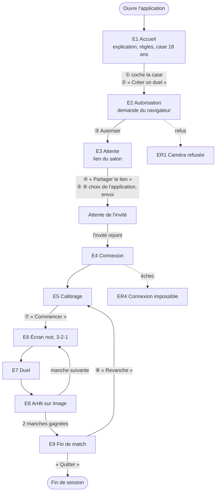
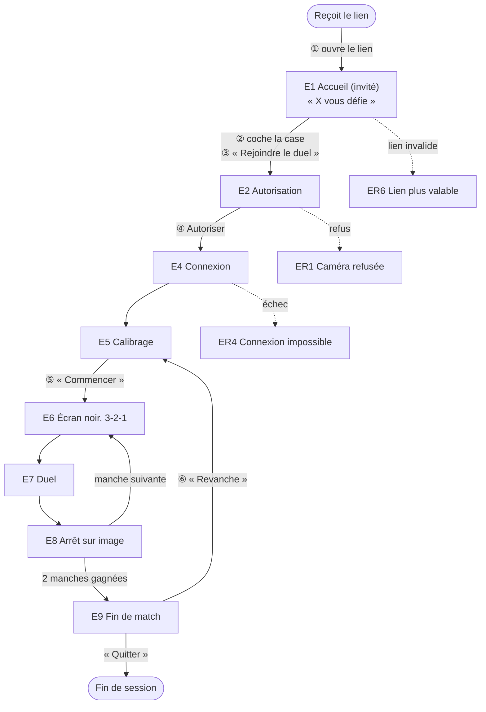

# D5 — Parcours utilisateur et maquettes d'écrans

| Champ | Valeur |
|---|---|
| Objet | Dire ce que voit et fait chaque joueur, du lien reçu à la revanche, et ce qu'il voit quand quelque chose échoue |
| Statut | Brouillon |
| Date | 2026-09-25 |
| Dépend de | [D2](D2-regles-jeu-arbitrage.md) (machine à états §6, règles affichées §6.8, messages de calibrage R1) ; [D4](D4-architecture-technique.md) (mise en page §10, risques §12) ; [source de cadrage](../sources/cadrage-lots-1-2-3.md) §3.5, §4.1 ; [D8](D8-journal-decisions.md) n° 9, 17, 28, 29, 97 à 110, 111 à 125, 126 à 133 |
| Utilisé par | [D6](D6-lots-developpement.md) (lots d'interface) ; [D7](D7-juridique-confidentialite.md) (texte d'explication, case d'âge) |

## 1. Conventions

- **Geste** : un appui ou un clic de l'utilisateur, y compris l'acceptation d'une demande du navigateur. Aucune saisie au clavier n'est nécessaire dans tout le parcours.
- Chaque écran porte un code (E1, E2…) et renvoie à l'état de [D2](D2-regles-jeu-arbitrage.md) §6.2 qu'il affiche.
- Les textes entre guillemets sont les **textes exacts** affichés. Les nombres qu'ils contiennent suivent les réglages de [D2](D2-regles-jeu-arbitrage.md) §3 et §6.7.
- Maquettes : téléphone en portrait (22 colonnes), ordinateur en paysage (47 colonnes). `[Texte]` = bouton ; `( )` = case à cocher ; `J` = jauge.
- Tutoiement ou vouvoiement : vouvoiement partout. **Hypothèse à valider** (Q1)

## 2. Parcours

### 2.1 Parcours de l'hôte



### 2.2 Parcours de l'invité



L'accueil de l'invité ne peut pas afficher le nom de l'hôte : aucun compte, aucune saisie. Texte retenu : « Vous êtes défié au jeu Ne souris pas ». **Hypothèse à valider** (Q2)

### 2.3 Nombre de gestes

| Parcours | Du départ au premier duel | Pour une revanche |
|---|---|---|
| Hôte | 7 : case, « Créer un duel », Autoriser, « Partager le lien », choix de l'application, envoi, « Commencer » | 2 : « Revanche », « Commencer » |
| Invité (du lien reçu) | 5 : ouvrir le lien, case, « Rejoindre le duel », Autoriser, « Commencer » | 2 : « Revanche », « Commencer » |

- Sur certains navigateurs, caméra et micro font l'objet de deux demandes séparées : un geste de plus.
- « Commencer » au calibrage coûte un geste, mais garantit que le joueur est en place avant la mesure du neutre. Sans lui, le calibrage démarrerait pendant que le joueur pose encore son téléphone, et serait rejeté. **Hypothèse à valider** (Q3)
- Rien n'est mémorisé d'une visite à l'autre (principe « rien n'est stocké », [D4](D4-architecture-technique.md) §1) : la case d'âge est à recocher à chaque salon.

## 3. Écrans

Correspondance avec [D2](D2-regles-jeu-arbitrage.md) §6.2 :

| Écran | État de D2 | Transitions de D2 |
|---|---|---|
| E1 Accueil | Accueil | T1, T2 |
| E2 Autorisation | Autorisation | T2 à T6 |
| E3 Attente | Attente | T4, T7 |
| E4 Connexion | Connexion | T5, T8, T9 |
| E5 Calibrage | Calibrage | T8, T10, T11, T29 |
| E6 Écran noir et compte à rebours | Écran noir, Compte à rebours | T12 à T15, T22 |
| E7 Duel | Manche, Décision | T15 à T18 |
| E8 Arrêt sur image | Arrêt sur image | T19 à T23 |
| E9 Fin de match | Fin de match | T23, T24, T27 à T31 |
| E10 Interruption | Interrompu | T25 à T27 |
| E11 Règles | Superposé à tout état | — |
| ER1 à ER12 | États d'erreur et fin de session | Section 4 |

### 3.1 E1 — Accueil : explication et âge

- **Objectif** : dire ce qui va se passer avec la caméra **avant** la demande du navigateur (n° 29) ; recueillir la déclaration d'âge ; présenter les règles.
- **Éléments** : nom du jeu ; phrase d'accroche ; les 5 règles ([D2](D2-regles-jeu-arbitrage.md) §6.8) ; bloc « Votre caméra » ; case d'âge ; bouton principal ; lien « Confidentialité ».
- **Actions** : cocher la case ; bouton principal (désactivé tant que la case n'est pas cochée) ; ouvrir la page de confidentialité ([D7](D7-juridique-confidentialite.md)).

Textes exacts :

| Élément | Texte |
|---|---|
| Titre | « Ne souris pas » |
| Accroche (hôte) | « Défiez un ami : le premier qui sourit perd. » |
| Accroche (invité) | « Vous êtes défié au jeu Ne souris pas. » |
| Règles | Les 5 phrases de [D2](D2-regles-jeu-arbitrage.md) §6.8 |
| Bloc caméra, titre | « Votre caméra et votre micro » |
| Bloc caméra, texte | « Votre adversaire vous voit et vous entend pendant la partie. Votre sourire est détecté sur votre appareil. Rien n'est enregistré, ni image, ni son. » |
| Case | « J'ai 18 ans ou plus » |
| Bouton (hôte) | « Créer un duel » |
| Bouton (invité) | « Rejoindre le duel » |
| Lien | « Confidentialité » |

Téléphone, portrait :

```
+----------------------+
|   NE SOURIS PAS      |
| Défiez un ami : le   |
| premier qui sourit   |
| perd.                |
|----------------------|
| 1. Le premier qui…   |
| 2. Parlez, grimacez… |
| 3. Gardez votre…     |
| 4. Votre jauge…      |
| 5. Si personne…      |
|----------------------|
| Votre caméra et      |
| votre micro          |
| Votre adversaire vous|
| voit et vous entend… |
|----------------------|
| ( ) J'ai 18 ans ou + |
| [  Créer un duel   ] |
|   Confidentialité    |
+----------------------+
```

Ordinateur, paysage :

```
+---------------------------------------------+
|              NE SOURIS PAS                  |
|  Défiez un ami : le premier qui sourit perd.|
+----------------------+----------------------+
| Règles               | Votre caméra et      |
| 1. Le premier qui…   | votre micro          |
| 2. Parlez, grimacez… | Votre adversaire vous|
| 3. Gardez votre…     | voit et vous entend… |
| 4. Votre jauge…      |                      |
| 5. Si personne…      | ( ) J'ai 18 ans ou + |
|                      | [  Créer un duel   ] |
+----------------------+----------------------+
|               Confidentialité               |
+---------------------------------------------+
```

### 3.2 E2 — Autorisation

- **Objectif** : obtenir l'accès caméra et micro, en expliquant la demande du navigateur qui s'affiche par-dessus.
- **Éléments** : fond sombre ; flèche vers la zone où le navigateur affiche sa demande ; texte d'aide.
- **Actions** : aucune dans l'application ; « Autoriser » ou « Refuser » dans la demande du navigateur.

| Élément | Texte |
|---|---|
| Titre | « Autorisez la caméra et le micro » |
| Aide | « Votre navigateur vous le demande. Sans caméra, pas de duel. » |

Téléphone, portrait :

```
+----------------------+
|        ↑             |
|  Autorisez la caméra |
|  et le micro         |
|                      |
|  Votre navigateur    |
|  vous le demande.    |
|  Sans caméra, pas    |
|  de duel.            |
+----------------------+
```

Ordinateur, paysage :

```
+---------------------------------------------+
|  ↖                                          |
|        Autorisez la caméra et le micro      |
|  Votre navigateur vous le demande.          |
|  Sans caméra, pas de duel.                  |
+---------------------------------------------+
```

### 3.3 E3 — Attente (hôte)

- **Objectif** : partager le lien et patienter ; vérifier son cadrage en attendant.
- **Éléments** : sa propre vidéo ; le lien ; bouton de partage ; bouton de copie ; mention de l'expiration.
- **Actions** : « Partager le lien » (feuille de partage du système, si disponible) ; « Copier » ; « Annuler ».

| Élément | Texte |
|---|---|
| Titre | « Envoyez ce lien à votre adversaire » |
| Bouton | « Partager le lien » |
| Bouton | « Copier » ; après appui : « Lien copié » |
| Attente | « En attente de votre adversaire… » |
| Expiration | « Le lien expire dans 15 minutes s'il n'est pas utilisé. » |
| Bouton | « Annuler » |

Téléphone, portrait :

```
+----------------------+
| Envoyez ce lien à    |
| votre adversaire     |
| nesouris.pas/#k3F…   |
| [Partager le lien]   |
| [Copier]             |
|----------------------|
|                      |
|    Votre vidéo       |
|                      |
|----------------------|
| En attente de votre  |
| adversaire…          |
| Le lien expire dans  |
| 15 minutes…          |
| [Annuler]            |
+----------------------+
```

Ordinateur, paysage :

```
+---------------------------------------------+
| Envoyez ce lien à votre adversaire          |
| nesouris.pas/#k3F…  [Copier] [Partager]     |
+----------------------+----------------------+
|                      |                      |
|    Votre vidéo       |  En attente de votre |
|                      |  adversaire…         |
+----------------------+----------------------+
| Le lien expire dans 15 minutes…  [Annuler]  |
+---------------------------------------------+
```

L'adresse affichée est un exemple : le nom de domaine n'est pas choisi (n° 46, nom et identité visuelle écartés jusqu'aux tests).

### 3.4 E4 — Connexion

- **Objectif** : faire patienter pendant l'établissement du canal (20 s au plus).
- **Éléments** : sa propre vidéo ; indicateur d'attente.
- **Actions** : « Annuler ».

| Élément | Texte |
|---|---|
| Hôte | « Votre adversaire arrive… » |
| Invité | « Connexion à votre adversaire… » |
| Après 10 s | « C'est plus long que prévu… » |

Téléphone, portrait :

```
+----------------------+
|  Connexion à votre   |
|  adversaire…    ◌    |
|----------------------|
|    Votre vidéo       |
|----------------------|
| [Annuler]            |
+----------------------+
```

Ordinateur, paysage :

```
+---------------------------------------------+
|        Connexion à votre adversaire… ◌      |
+----------------------+----------------------+
|    Votre vidéo       |        ◌             |
+----------------------+----------------------+
|                 [Annuler]                   |
+---------------------------------------------+
```

### 3.5 E5 — Calibrage

- **Objectif** : mesurer le neutre et le sourire volontaire ([D2](D2-regles-jeu-arbitrage.md) R1).
- **Éléments** : sa propre vidéo avec un cadre ovale de placement ; consigne ; barre de progression de la phase ; statut de l'adversaire ; vidéo de l'adversaire en petit.
- **Actions** : « Commencer » ; « Recommencer » après un rejet ; « Abandonner ».

| Moment | Texte |
|---|---|
| Avant | « Placez votre visage dans l'ovale, bien éclairé, puis appuyez sur Commencer. » ; bouton « Commencer » |
| Phase neutre (3 s) | « Visage neutre, sans parler… » |
| Phase sourire (2 s) | « Maintenant, souriez franchement ! » |
| Réussite, adversaire pas prêt | « C'est bon. En attente de votre adversaire… » |
| Statut adverse | « Votre adversaire se calibre… » / « Votre adversaire est prêt » / « Votre adversaire recommence son calibrage » |
| Rejet : présence | « Gardez votre visage dans l'ovale. » |
| Rejet : deux visages | « Un seul visage dans le champ. » |
| Rejet : largeur | « Rapprochez-vous de la caméra. » |
| Rejet : angles | « Regardez l'écran bien en face. » |
| Rejet : luminance | Écran ER3 (section 4) |
| Rejet : écart-type | « Restez silencieux et immobile. » |
| Rejet : neutre trop haut | « Détendez votre visage, sans sourire. » |
| Rejet : amplitude | « Souriez franchement. » |
| Après un rejet | Bouton « Recommencer » |

Téléphone, portrait :

```
+----------------------+
| Adversaire : prêt ✓  |
| +------+             |
| | adv. |             |
| +------+             |
|  .----------.        |
| (  votre    )        |
| (  visage   )        |
|  '----------'        |
| Visage neutre, sans  |
| parler…              |
| [=======-----] 3 s   |
| [Abandonner]         |
+----------------------+
```

Ordinateur, paysage :

```
+---------------------------------------------+
| Calibrage                Adversaire : prêt ✓|
+----------------------+----------------------+
|   .----------.       |                      |
|  (  votre     )      |   Vidéo adversaire   |
|  (  visage    )      |                      |
|   '----------'       |                      |
+----------------------+----------------------+
| Visage neutre, sans parler…  [=====---] 3 s |
|                [Abandonner]                 |
+---------------------------------------------+
```

### 3.6 E6 — Écran noir, compte à rebours, révélation

- **Objectif** : créer le moment d'apparition (n° 17) ; laisser le temps à la synchronisation.
- **Éléments** : fond noir ; numéro de manche ; score ; chiffres 3, 2, 1 en grand. Aucune vidéo, aucune jauge. Le son reste ouvert (n° 109).
- **Actions** : « Abandonner » (discret).

| Moment | Texte |
|---|---|
| Écran noir | « Manche 2 » ; « 1 – 0 » (son score d'abord) |
| Appareil trop lent (T14) | Écran ER7 superposé |
| Compte à rebours | « 3 », « 2 », « 1 » |
| Révélation | Aucun texte : les deux visages apparaissent ensemble |

Téléphone, portrait :

```
+----------------------+
|                      |
|      Manche 2        |
|       1 – 0          |
|                      |
|         3            |
|                      |
|                      |
|      [Abandonner]    |
+----------------------+
```

Ordinateur, paysage :

```
+---------------------------------------------+
|                                             |
|                 Manche 2                    |
|                  1 – 0                      |
|                    3                        |
|                                             |
|                [Abandonner]                 |
+---------------------------------------------+
```

### 3.7 E7 — Duel

- **Objectif** : jouer. Voir les deux visages et les deux jauges ([D2](D2-regles-jeu-arbitrage.md) §6.6).
- **Éléments** : deux vidéos de même taille ; deux jauges avec repère de pic ; chronomètre ; numéro de manche ; score ; avertissements.
- **Actions** : « Abandonner » (avec confirmation, la manche continue, [D2](D2-regles-jeu-arbitrage.md) §6.5.1) ; « Règles ».

| Élément | Texte |
|---|---|
| Chronomètre | Secondes restantes : « 60 » à « 0 » |
| Avertissement, soi (T16) | « Visage perdu : encore une fois et vous perdez la manche » |
| Avertissement, adversaire | « Visage perdu » sur sa vidéo |
| Jauge adverse sans valeur depuis 1 s | Jauge grisée, sans texte |
| Confirmation d'abandon | « Abandonner le match ? » ; boutons « Oui, abandonner » et « Continuer à jouer » |

Téléphone, portrait :

```
+----------------------+
| Manche 2  1 – 0   42 |
+----------------------+
|                    |=|
|   Vidéo adversaire |=|
|                    |-|
+----------------------+
|                    |=|
|    Votre vidéo     |-|
|                    |-|
+----------------------+
| [Abandonner]  [?]    |
+----------------------+
```

Ordinateur, paysage :

```
+---------------------------------------------+
|  Manche 2          1 – 0                42  |
+----------------------+----------------------+
|                      |                      |
|    Votre vidéo       |   Vidéo adversaire   |
|                      |                      |
+----------------------+----------------------+
| J ======|--          | J ===|------         |
+----------------------+----------------------+
|            [Abandonner]   [Règles]          |
+---------------------------------------------+
```

`|` dans une jauge : repère du pic de la manche.

### 3.8 E8 — Arrêt sur image

- **Objectif** : montrer la preuve et le résultat de la manche pendant 5 s ([D2](D2-regles-jeu-arbitrage.md) R7).
- **Éléments** : selon la cause, l'image fixe du joueur qui a souri, ou un message ; résultat ; nouveau score.
- **Actions** : aucune (passage automatique) ; « Abandonner ».

| Cause | Ce qui s'affiche | Texte pour le perdant | Texte pour le gagnant |
|---|---|---|---|
| Sourire | Image fixe du perdant, en grand | « Vous avez souri ! Manche perdue. » | « Votre adversaire a souri ! Manche gagnée. » |
| Visage perdu | Pas d'image | « Visage perdu. Manche perdue. » | « Votre adversaire a perdu son visage. Manche gagnée. » |
| Départage à 60 s | Les deux pics, en pourcentage | « Personne n'a craqué. Votre jauge est montée plus haut : manche perdue. » | « Personne n'a craqué. Votre jauge est restée plus basse : manche gagnée. » |
| Égalité | Pas d'image | « Égalité, manche rejouée. » (les deux) | Idem |
| Image non reçue | Pas d'image | « Vous avez souri ! Manche perdue. » | « Votre adversaire a souri ! Image indisponible. Manche gagnée. » |
| Coupure en manche, reconnexion (manche interrompue) | Pas d'image | « Manche interrompue, rejouée. » (les deux) | Idem |

Téléphone, portrait :

```
+----------------------+
| Votre adversaire a   |
| souri !              |
| +------------------+ |
| |                  | |
| |  image fixe du   | |
| |  sourire         | |
| |                  | |
| +------------------+ |
| Manche gagnée        |
|      2 – 0           |
+----------------------+
```

Ordinateur, paysage :

```
+---------------------------------------------+
|        Votre adversaire a souri !           |
|        +---------------------------+        |
|        |   image fixe du sourire   |        |
|        +---------------------------+        |
|          Manche gagnée — 2 – 0              |
+---------------------------------------------+
```

L'image fixe n'est ni téléchargeable ni partageable : aucun bouton, aucun menu (n° 69). Une capture d'écran par le joueur reste possible et ne peut pas être empêchée par une page web. Voir [D7](D7-juridique-confidentialite.md).

### 3.9 E9 — Fin de match et revanche

- **Objectif** : annoncer le vainqueur ; proposer la revanche en un geste.
- **Éléments** : résultat ; score final ; deux vidéos en direct (on se voit rire ou râler) ; boutons ; délai de revanche.
- **Actions** : « Revanche » ; « Quitter ».

| Moment | Texte |
|---|---|
| Victoire | « Vous avez gagné 2 – 1 ! » |
| Défaite | « Vous avez perdu 1 – 2. » |
| Victoire par abandon | « Votre adversaire a abandonné. Victoire. » |
| Abandon | « Vous avez abandonné. » |
| Victoire par forfait | « Votre adversaire n'est pas revenu. Victoire par forfait. » ; pas de bouton « Revanche » |
| Match annulé | « Le match n'a pas pu commencer. » ; pas de bouton « Revanche » |
| Boutons | « Revanche » ; « Quitter » |
| Après son appui sur Revanche | « En attente de votre adversaire… » |
| L'adversaire a demandé | « Votre adversaire veut une revanche ! » ; « Revanche » mis en avant |
| Délai | « Revanche possible encore 45 s » (décompte à partir de 60 s) |

Téléphone, portrait :

```
+----------------------+
| Vous avez gagné      |
| 2 – 1 !              |
|----------------------|
|   Vidéo adversaire   |
|----------------------|
|    Votre vidéo       |
|----------------------|
| Votre adversaire veut|
| une revanche !       |
| [    Revanche     ]  |
| [Quitter]            |
| Revanche possible    |
| encore 45 s          |
+----------------------+
```

Ordinateur, paysage :

```
+---------------------------------------------+
|             Vous avez gagné 2 – 1 !         |
+----------------------+----------------------+
|    Votre vidéo       |   Vidéo adversaire   |
+----------------------+----------------------+
|   Votre adversaire veut une revanche !      |
|        [   Revanche   ]   [Quitter]         |
|        Revanche possible encore 45 s        |
+---------------------------------------------+
```

### 3.10 E10 — Interruption

- **Objectif** : faire patienter pendant 30 s au plus quand l'adversaire est injoignable ([D2](D2-regles-jeu-arbitrage.md) §6.4).
- **Éléments** : dernière image de l'adversaire, grisée ; compte à rebours ; jauges figées.
- **Actions** : « Quitter » (vaut abandon si le match est en cours).

| Côté | Texte |
|---|---|
| Joueur resté connecté | « Votre adversaire a perdu la connexion. Attente… 30 s » |
| Joueur dont la connexion tombe | « Connexion perdue. Reconnexion… » |
| Reprise | « Reprise » (1 s) |

Téléphone, portrait :

```
+----------------------+
| Votre adversaire a   |
| perdu la connexion.  |
|  Attente… 24 s       |
|----------------------|
|  (image grisée)      |
|----------------------|
|    Votre vidéo       |
|----------------------|
| [Quitter]            |
+----------------------+
```

Ordinateur, paysage :

```
+---------------------------------------------+
|  Votre adversaire a perdu la connexion.     |
|               Attente… 24 s                 |
+----------------------+----------------------+
|    Votre vidéo       |   (image grisée)     |
+----------------------+----------------------+
|                 [Quitter]                   |
+---------------------------------------------+
```

### 3.11 E11 — Règles

- **Objectif** : relire les règles sans quitter la partie.
- **Éléments** : panneau par-dessus l'écran ; les 5 règles de [D2](D2-regles-jeu-arbitrage.md) §6.8.
- **Actions** : « Fermer ». La manche continue derrière le panneau : l'ouvrir ne met rien en pause. Sur téléphone, le panneau couvre au plus la moitié basse, pour que le joueur reste face à la caméra. **Hypothèse à valider**

## 4. Écrans d'erreur

Toute erreur affiche : ce qui s'est passé, ce que le joueur peut faire, un seul bouton principal.

| Code | Situation | État de D2 | Message exact | Action pour s'en sortir |
|---|---|---|---|---|
| ER1 | Caméra ou micro refusés | Erreur caméra (T3) | « Sans caméra ni micro, le duel est impossible. Autorisez-les dans les réglages de votre navigateur, puis réessayez. » | Bouton « Réessayer » ; lien « Comment faire ? » avec la marche à suivre pour Safari, Chrome et Firefox |
| ER2 | Aucune caméra détectée | Erreur caméra (T3) | « Aucune caméra trouvée sur cet appareil. Essayez avec un téléphone ou un ordinateur équipé d'une webcam. » | Bouton « Réessayer » |
| ER3 | Lumière insuffisante (rejet de calibrage, luminance) | Calibrage (T11) | « Pas assez de lumière. Allumez une lampe face à vous ou tournez-vous vers une fenêtre. » | Bouton « Recommencer » |
| ER4 | Connexion impossible | Erreur connexion (T9) | « Impossible de joindre votre adversaire. Vérifiez votre connexion internet, puis réessayez. » | Bouton « Réessayer » ; après deux échecs, conseil : « Essayez de passer du Wi-Fi à la 4G, ou l'inverse. » |
| ER5 | Adversaire parti | Fin de session (T30) | « Votre adversaire est parti. » | Bouton « Créer un nouveau duel » |
| ER6 | Lien plus valable (salon introuvable, expiré ou complet) | Erreur salon (T6) | « Ce lien n'est plus valable. Demandez un nouveau lien à votre adversaire. » | Bouton « Créer mon propre duel » |
| ER7 | Appareil trop lent | Écran noir (T14) | « Appareil trop lent : fermez les autres applications. Nouvel essai dans 5 s… » | Attente automatique ; bouton « Abandonner » |
| ER8 | Navigateur incompatible | Accueil (avant T2) | « Ce navigateur ne permet pas de jouer. Utilisez une version récente de Safari, Chrome, Edge ou Firefox. » | Bouton « Copier le lien » pour l'ouvrir ailleurs |
| ER9 | Versions différentes des deux applications | Connexion ([D4](D4-architecture-technique.md) §4.2) | « Votre adversaire utilise une autre version du jeu. Rechargez tous les deux la page. » | Bouton « Recharger » |
| ER10 | Connexion perdue, aucun vainqueur | Fin de session (T27) | « Connexion perdue. Match interrompu. » | Bouton « Créer un nouveau duel » |
| ER11 | Salon expiré sans invité | Salon expiré (T7) | « Personne n'a rejoint. Le lien a expiré. » | Bouton « Créer un nouveau salon » |
| ER12 | Caméra déjà utilisée par une autre application | Erreur caméra (T3) | « Votre caméra est utilisée par une autre application. Fermez-la, puis réessayez. » | Bouton « Réessayer » |
| ER13 | Forfait du joueur revenu trop tard | Fin de session (T27) | « Match perdu par forfait. » | Bouton « Créer un nouveau salon » |
| ER14 | Fin de session après 60 s sans revanche | Fin de session (T31) | « Le salon a expiré. » | Bouton « Créer un nouveau salon » |

Maquette commune (téléphone, portrait) :

```
+----------------------+
|         (!)          |
| Impossible de joindre|
| votre adversaire.    |
| Vérifiez votre       |
| connexion internet,  |
| puis réessayez.      |
|                      |
| [    Réessayer     ] |
+----------------------+
```

Maquette commune (ordinateur, paysage) :

```
+---------------------------------------------+
|                    (!)                      |
|      Impossible de joindre votre adversaire.|
|   Vérifiez votre connexion internet, puis   |
|                 réessayez.                  |
|              [  Réessayer  ]                |
+---------------------------------------------+
```

## 5. Vérification de cohérence

Vérification faite en lisant [D2](D2-regles-jeu-arbitrage.md) §6 et [D4](D4-architecture-technique.md). Le graphe graphify n'a servi qu'à retrouver les exigences de la source : après `graphify update .`, il ne contient que les titres des sections ajoutées aux lots 4 et 5, pas leur contenu (voir Q6).

| Contrôle | Résultat |
|---|---|
| Chaque état de D2 a un écran | Oui. Décision est affichée par E7 (rien ne change à l'écran, moins d'une seconde) |
| Chaque écran correspond à un état de D2 | Oui, sauf E11 (panneau superposé, sans état) et ER8 (vérification avant la machine à états) : deux ajouts proposés à D2 (Q4) |
| Messages de rejet du calibrage identiques à D2 R1 | Oui pour « Restez silencieux et immobile », « Souriez franchement », « Un seul visage dans le champ ». Les autres causes n'avaient pas de texte dans D2 : textes créés ici |
| Mise en page conforme à D4 §10 | Oui : portrait empilé, paysage côte à côte, jauges verticales en portrait |
| Contraintes D4 | Geste avant la lecture du son (RT8) : « Créer un duel », « Rejoindre le duel » et « Commencer » en tiennent lieu. Version du protocole : ER9. Wake Lock : aucun écran dédié (RT13) |
| Texte d'avertissement T16 | Identique à D2 |

## 6. Questions ouvertes

| N° | Question | Proposition |
|---|---|---|
| Q1 | Tutoiement ou vouvoiement ? Le jeu se joue entre amis ; le tutoiement serait plus naturel. | Vouvoiement, hypothèse appliquée (plus neutre tant que le public n'est pas testé) |
| Q2 | L'invité ne voit pas qui le défie (aucun nom). Ajouter un champ facultatif « Votre prénom » chez l'hôte ? Cela ajoute une saisie et une donnée transmise. | Non en v1, hypothèse appliquée : le lien arrive par une messagerie qui dit déjà qui l'envoie |
| Q3 | Garder le bouton « Commencer » avant le calibrage (un geste de plus) ? | Oui, hypothèse appliquée |
| Q4 | Ajouter à [D2](D2-regles-jeu-arbitrage.md) un état « Navigateur incompatible » (ER8) et préciser que le panneau Règles (E11) ne suspend rien ? | Oui, au prochain passage sur D2 |
| Q5 | « Côte à côte » (n° 17) interprété comme « ensemble à l'écran » : empilés en portrait. Question posée dans [D4](D4-architecture-technique.md) Q5 | Voir D4 |
| Q6 | Le graphe graphify ne contient que les titres des lots 4 et suivants. Relancer `/graphify . --update` ? | Oui, avant de valider ces documents |
| Q7 | Nom de domaine et nom définitif du jeu : écartés jusqu'aux tests (n° 46). L'adresse des maquettes est un exemple. | Garder l'exemple |
