# D6 — Découpage en lots de développement

| Champ | Valeur |
|---|---|
| Objet | Dire ce que livre chaque lot de développement, comment on sait qu'il est terminé, quel test de D3 le valide, et quel lot abandonner ou modifier si un test échoue |
| Statut | Brouillon |
| Date | 2026-09-25 |
| Dépend de | [D2](D2-regles-jeu-arbitrage.md) ; [D3](D3-plan-de-tests.md) ; [D4](D4-architecture-technique.md) ; [D5](D5-parcours-maquettes.md) ; [source de cadrage](../sources/cadrage-lots-1-2-3.md) §3.7, §4.1 ; [D8](D8-journal-decisions.md) n° 35, 44, 52 à 54, 70, 77, 82, 134 à 147, 175 à 178, 181, 210 à 212, 216, 219 à 225 |
| Utilisé par | [D3](D3-plan-de-tests.md) (renvois aux lots) |

## 1. Conventions

- Un **lot de développement** (L0.1, L1.2…) se livre et se teste en **une séance** de travail de 3 à 4 heures (n° 44, n° 210). Si un lot déborde, il est coupé en deux avant de commencer, pas pendant.
- Les lots sont rattachés aux prototypes : **P0** détection seule, **P1** appel vidéo seul, **P2** duel complet (n° 35).
- On ne commence pas un prototype avant la décision « Go » du précédent ([D3](D3-plan-de-tests.md) §1.6, §2.6, §3.7).
- **Terminé** : le critère est vérifié sur un appareil réel, pas seulement sur l'ordinateur de développement, et le lot est versionné.
- Les **modules** sont ceux de [D4](D4-architecture-technique.md) §2 : Interface, Capture, Détection, Arbitrage, WebRTC, Mise en relation, Hébergement.
- Aucun lot ne stocke d'image ni de son (n° 26). Seul le journal numérique de test (n° 73) est écrit, sur l'ordinateur de Valentin, dans un dossier chiffré séparé (n° 216).

## 2. Vue d'ensemble

```mermaid
flowchart LR
    subgraph P0["P0 — détection seule"]
        L01["L0.1 Socle"] --> L02["L0.2 Détection"]
        L02 --> L03["L0.3 Calibrage"]
        L03 --> L04["L0.4 Sourire et jauge"]
        L04 --> L05["L0.5 Pertes et preuve"]
        L05 --> L06["L0.6 Outils de test"]
        L06 --> L07["L0.7 Rejeu"]
    end
    subgraph P1["P1 — appel vidéo seul"]
        L11["L1.1 Salon"] --> L12["L1.2 Appel et relais"]
        L12 --> L13["L1.3 Canal de jeu"]
        L13 --> L14["L1.4 Horloges"]
        L12 --> L15["L1.5 Charge réelle"]
    end
    subgraph P2["P2 — duel complet"]
        L21a["L2.1a Déroulé : accueil à calibrage"] --> L21b["L2.1b Déroulé : écran noir à score"]
        L21b --> L22["L2.2 Arbitrage réparti"]
        L22 --> L23["L2.3 Preuve, fin, revanche"]
        L21b --> L24["L2.4 Écrans et erreurs"]
        L23 --> L25["L2.5 Journal P2"]
        L24 --> L25
        L25 --> L26["L2.6 Pages légales"]
    end
    L07 -- "Go P0" --> L11
    L14 -- "Go P1" --> L21a
    L15 -- "Go P1" --> L21a
```

| Lot | Prototype | Objectif en une phrase | Modules | Test ([D3](D3-plan-de-tests.md)) |
|---|---|---|---|---|
| L0.1 | P0 | Afficher la caméra dans une PWA servie sans aucun tiers | Interface, Capture, Hébergement | §1.2.3 (appareils) |
| L0.2 | P0 | Analyser le visage à cadence plafonnée | Détection | §1.3.8, G3 |
| L0.3 | P0 | Calibrer le joueur (R1) | Arbitrage, Interface | A0, §1.3.5, G4 |
| L0.4 | P0 | Détecter le sourire et afficher la jauge (R2, R3) | Arbitrage, Interface | A1 à A6, G1, G5 |
| L0.5 | P0 | Compter les pertes (R4) et produire l'image de preuve (R7) | Arbitrage, Interface | A7 |
| L0.6 | P0 | Outiller le protocole de test | Interface | §1.3 entier |
| L0.7 | P0 | Rejouer un journal avec d'autres valeurs | Arbitrage | §1.5, étapes 9 et 10 |
| L1.1 | P1 | Créer un salon, partager le lien, se rejoindre | Mise en relation, Interface | §2.3.1 |
| L1.2 | P1 | Appel audio et vidéo, direct ou relayé | WebRTC | §2.3.1, §2.3.2, C1, C2 |
| L1.3 | P1 | Canal de jeu, battement, coupure, reconnexion, présence | WebRTC, Mise en relation | §2.3.4, C4 |
| L1.4 | P1 | Synchroniser les horloges et mesurer l'erreur réelle | Arbitrage, WebRTC | §2.3.3, C3 |
| L1.5 | P1 | Mesurer la cadence avec un vrai appel en cours | Détection, WebRTC | §2.3.5, C5 |
| L2.1a | P2 | Dérouler le match de l'accueil au calibrage des deux joueurs | Interface, Arbitrage | §3.3 |
| L2.1b | P2 | Dérouler les manches, de l'écran noir au score | Interface, Arbitrage | §3.3 |
| L2.2 | P2 | Décider la manche à deux appareils (R5, R6) | Arbitrage | §3.3, A1 et A2 de P2 |
| L2.3 | P2 | Transmettre la preuve ; fin de match, abandon, revanche | Arbitrage, WebRTC, Interface | §3.3, V1 |
| L2.4 | P2 | Écrans téléphone et ordinateur ; écrans d'erreur | Interface | §3.3, questionnaire |
| L2.5 | P2 | Journal P2 et métriques | Interface | §3.4, §3.6 |
| L2.6 | P2 | Pages de confidentialité, mentions légales, conditions | Interface | Relecture [D7](D7-juridique-confidentialite.md) |

## 3. Détail des lots

### 3.1 Prototype 0 — détection seule

#### L0.1 — Socle

| Rubrique | Contenu |
|---|---|
| Tâches | Accès caméra avec la caméra frontale, sur un geste du joueur ; vidéo en miroir ; bibliothèque MediaPipe 1.0.1, modèle et WebAssembly servis depuis `app/` et chargés une fois pour vérifier le service ([D4](D4-architecture-technique.md) §1, principe 5, n° 220) ; politique de sécurité qui bloque tout chargement externe, tentatives bloquées affichées (n° 221, n° 225) ; mise en ligne en HTTPS : dépôt public `Vartax77/ne-souris-pas`, branche `main`, action GitHub `.github/workflows/pages.yml` qui publie `app/` sur GitHub Pages (n° 204, n° 219). Manifeste et service worker reportés à L2.4 (n° 224) |
| Modules | Interface, Capture, Hébergement |
| Terminé quand | Sur les trois appareils de test ([D3](D3-plan-de-tests.md) §1.2.3) : la caméra s'affiche en miroir, « MediaPipe prêt » s'affiche, et aucun chargement externe n'a abouti (seule tentative bloquée attendue : les statistiques de MediaPipe, n° 225) |
| Test | [D3](D3-plan-de-tests.md) §1.2.3 |
| Dépend de | — |

#### L0.2 — Détection

| Rubrique | Contenu |
|---|---|
| Tâches | Face Landmarker avec blendshapes, matrice de transformation, jusqu'à 2 visages ([D2](D2-regles-jeu-arbitrage.md) §2) ; calcul du lacet, du tangage, de la largeur, de la luminance ; cadence plafonnée à 15 images/s ; mesure de la cadence par fenêtre de 10 s ; affichage du mode de calcul (processeur graphique ou central, [D4](D4-architecture-technique.md) RT1) |
| Modules | Détection |
| Terminé quand | La cadence mesurée s'affiche et ne dépasse jamais 15 images/s ; les valeurs brutes s'affichent en direct |
| Test | [D3](D3-plan-de-tests.md) §1.3.8, critère G3 |
| Dépend de | L0.1 |

#### L0.3 — Calibrage

| Rubrique | Contenu |
|---|---|
| Tâches | R1 complet : phase neutre 3 s, phase sourire 2 s, sept causes de rejet dans l'ordre de [D2](D2-regles-jeu-arbitrage.md), messages de [D5](D5-parcours-maquettes.md) §3.5 ; calcul de `n`, `v`, `d` avec plafond `d_max` |
| Modules | Arbitrage, Interface |
| Terminé quand | Chaque cause de rejet a été provoquée volontairement au moins une fois et affiche le bon message |
| Test | [D3](D3-plan-de-tests.md) A0, §1.3.5, §1.3.6, critère G4 |
| Dépend de | L0.2 |

#### L0.4 — Sourire et jauge

| Rubrique | Contenu |
|---|---|
| Tâches | Score brut, variante `cheekSquint` en parallèle, lissage sur 3 images ; états neutre, doute, souriant, invalide ; série et confirmation (500 ms, 3 images, 1 image tolérée), horodatage rétroactif ; jauge `J` et pic |
| Modules | Arbitrage, Interface |
| Terminé quand | Un sourire franc tenu 1 s est confirmé ; un sourire de 300 ms ne l'est pas ; la jauge suit le visage |
| Test | [D3](D3-plan-de-tests.md) A1 à A6, critères G1 et G5 |
| Dépend de | L0.3 |

#### L0.5 — Pertes et preuve

| Rubrique | Contenu |
|---|---|
| Tâches | R4 : perte, avertissement, deuxième perte, perte continue de plus de 5 s ; R7 : images de la série en mémoire vive, choix de l'image au score le plus haut, affichage, effacement |
| Modules | Arbitrage, Interface |
| Terminé quand | Sortie du champ 2 s : avertissement ; 6 s : faute ; l'image de preuve s'affiche et aucune écriture n'apparaît dans le stockage du navigateur |
| Test | [D3](D3-plan-de-tests.md) A7 |
| Dépend de | L0.4 |

#### L0.6 — Outils de test

| Rubrique | Contenu |
|---|---|
| Tâches | Séquences minutées A0 à A7, B1 à B3, C, PERF avec consigne et chronomètre ; touche « sourire vu » ; revue après chaque sourire (confirmée, faux positif, litigieuse) ; journal CSV ([D3](D3-plan-de-tests.md) §1.4.1), enregistré dans un dossier chiffré séparé, hors du dépôt (n° 222) ; pic soutenu `P` en fin de séquence. Protection BitLocker déjà activée (n° 223) |
| Modules | Interface |
| Terminé quand | Une session à blanc de 30 min (Valentin seul) produit un journal complet et lisible au tableur, dans le dossier chiffré |
| Test | [D3](D3-plan-de-tests.md) §1.3 entier |
| Dépend de | L0.5 |

#### L0.7 — Rejeu

| Rubrique | Contenu |
|---|---|
| Tâches | Relire un journal CSV et rejouer R1 à R4 avec d'autres valeurs de réglage (maintien, lissage, `k`, `m`, angles) ; sortie : fautes par séquence |
| Modules | Arbitrage (le même code qu'en jeu, pas une copie) |
| Terminé quand | Le rejeu d'un journal avec les valeurs de départ redonne exactement les fautes observées en direct |
| Test | [D3](D3-plan-de-tests.md) §1.5, étapes 9 et 10 |
| Dépend de | L0.6 |

### 3.2 Prototype 1 — appel vidéo seul

#### L1.1 — Salon

| Rubrique | Contenu |
|---|---|
| Tâches | Code de salon aléatoire ; lien d'invitation ; ouverture et entrée dans le salon par le service de mise en relation retenu ([D4](D4-architecture-technique.md) §8) ; bibliothèque cliente PeerJS servie par l'hébergement de la PWA, version figée ([D4](D4-architecture-technique.md) §1, principe 5, n° 176) ; erreurs « lien plus valable » ; verrouillage à deux ; expiration à 15 min sans invité, puis à la fin de la session (n° 159) |
| Modules | Mise en relation, Interface |
| Terminé quand | Deux appareils se trouvent par le lien ; un troisième reçoit « Ce lien n'est plus valable » |
| Test | [D3](D3-plan-de-tests.md) §2.3.1 |
| Dépend de | Go P0 |

#### L1.2 — Appel et relais

| Rubrique | Contenu |
|---|---|
| Tâches | Connexion WebRTC audio et vidéo ; vidéo envoyée en 640 × 480, 1,7 Mbit/s au plus, en H.264 quand un iPhone joue ([D4](D4-architecture-technique.md) §7.3, §7.4, n° 177) ; serveurs STUN et TURN (UDP, TCP, TLS sur 443) ; option « relais forcé » pour le test ; journal P1 : type de candidat, temps d'établissement, aller-retour, débit, codec, pertes |
| Modules | WebRTC |
| Terminé quand | Appel établi entre un téléphone en 4G et un ordinateur en Wi-Fi, direct puis relais forcé |
| Test | [D3](D3-plan-de-tests.md) §2.3.1, §2.3.2, critères C1 et C2 |
| Dépend de | L1.1 |

#### L1.3 — Canal de jeu

| Rubrique | Contenu |
|---|---|
| Tâches | Canal de données ; enveloppe et version ([D4](D4-architecture-technique.md) §4.2) ; battement ; adversaire injoignable après 3 s ; reconnexion dans les 30 s ; interrogation de présence au serveur |
| Modules | WebRTC, Mise en relation |
| Terminé quand | Couper le Wi-Fi 10 s puis le rétablir : l'appel reprend ; le couper 40 s : le serveur désigne l'appareil absent |
| Test | [D3](D3-plan-de-tests.md) §2.3.4, critère C4 |
| Dépend de | L1.2 |

#### L1.4 — Horloges

| Rubrique | Contenu |
|---|---|
| Tâches | 5 allers-retours, décalage, `e`, `W` ([D4](D4-architecture-technique.md) §5.1) ; outil de mesure de l'erreur réelle par flash commun ([D3](D3-plan-de-tests.md) §2.3.3) |
| Modules | Arbitrage, WebRTC |
| Terminé quand | `e` et `W` s'affichent à chaque mesure ; le test du flash produit un écart par flash |
| Test | [D3](D3-plan-de-tests.md) §2.3.3, critère C3 |
| Dépend de | L1.3 |

#### L1.5 — Charge réelle

| Rubrique | Contenu |
|---|---|
| Tâches | Détection de L0.2 active pendant l'appel ; un seul flux caméra partagé ; cadence mesurée par fenêtre de 10 s ; mesure avec les réglages vidéo de L1.2 (H.264, 640 × 480), puis une fois en VP8 pour comparer (n° 177) |
| Modules | Détection, WebRTC |
| Terminé quand | Cadence journalisée pendant 10 min d'appel réel sur l'iPhone XR (le plus ancien), avec le codec et la résolution effectivement utilisés |
| Test | [D3](D3-plan-de-tests.md) §2.3.5, critère C5 |
| Dépend de | L1.2 |

### 3.3 Prototype 2 — duel complet

L2.1 a été coupé en deux avant de commencer : toute la machine à états en une séance dépassait la règle du §1 (n° 178).

#### L2.1a — Déroulé : de l'accueil au calibrage

| Rubrique | Contenu |
|---|---|
| Tâches | Machine à états de [D2](D2-regles-jeu-arbitrage.md) §6, première partie : vérification du navigateur (T32), accueil et case d'âge, autorisation, attente, connexion, contrôle de version (T33), calibrage des deux joueurs, statut de l'adversaire |
| Modules | Interface, Arbitrage |
| Terminé quand | Deux appareils arrivent ensemble à « deux calibrages réussis », depuis le lien, sans intervention |
| Test | [D3](D3-plan-de-tests.md) §3.3 |
| Dépend de | Go P1 |

#### L2.1b — Déroulé : de l'écran noir au score

| Rubrique | Contenu |
|---|---|
| Tâches | Machine à états de [D2](D2-regles-jeu-arbitrage.md) §6, seconde partie : écran noir, cadence commune, compte à rebours calé sur t0, manche de 60 s, décision, arrêt sur image, score, 2 manches gagnantes |
| Modules | Interface, Arbitrage |
| Terminé quand | Un match complet se joue entre deux appareils sans intervention, fautes simulées au clavier |
| Test | [D3](D3-plan-de-tests.md) §3.3 |
| Dépend de | L2.1a |

#### L2.2 — Arbitrage réparti

| Rubrique | Contenu |
|---|---|
| Tâches | Messages `faute`, `statut`, `pic_final`, `decision` ; R5 et R6 ; décision identique sur les deux appareils ; empreinte et divergence (T21) ; manche nulle, manche interrompue |
| Modules | Arbitrage |
| Terminé quand | Le rejeu de paires de journaux (L0.7) donne la même décision sur les deux appareils ; deux fautes à 50 ms d'écart donnent une manche nulle |
| Test | [D3](D3-plan-de-tests.md) §3.3, critères A1 et A2 de P2 |
| Dépend de | L2.1b |

#### L2.3 — Preuve, fin, revanche

| Rubrique | Contenu |
|---|---|
| Tâches | Envoi de l'image de preuve en morceaux ; fin de match ; abandon avec confirmation ; revanche à deux ; forfait ; libération de la mémoire à chaque fin de match |
| Modules | Arbitrage, WebRTC, Interface |
| Terminé quand | Cinq matchs d'affilée avec revanche sans ralentissement ; l'image arrive en moins de 2 s |
| Test | [D3](D3-plan-de-tests.md) §3.3, critère V1 |
| Dépend de | L2.2 |

#### L2.4 — Écrans et erreurs

| Rubrique | Contenu |
|---|---|
| Tâches | Écrans E1 à E11 et ER1 à ER15 de [D5](D5-parcours-maquettes.md), textes exacts ; manifeste et service worker, avec installation non proposée sur iOS (n° 202, n° 224) ; mise en page portrait et paysage ([D4](D4-architecture-technique.md) §10) ; maintien de l'écran allumé |
| Modules | Interface |
| Terminé quand | Chaque écran s'affiche sur téléphone portrait et ordinateur paysage ; chaque erreur a été provoquée une fois |
| Test | [D3](D3-plan-de-tests.md) §3.3, questionnaire §3.5 |
| Dépend de | L2.1b |

#### L2.5 — Journal P2

| Rubrique | Contenu |
|---|---|
| Tâches | Journal par match : durée et cause de chaque manche, `e`, `W`, cadence commune, coupures, divergences, image reçue ou non, revanche ; export en fin de session sur l'appareil de l'hôte, avec l'accord des deux joueurs |
| Modules | Interface |
| Terminé quand | Un match produit une ligne par manche, lisible au tableur, sans image ni son |
| Test | [D3](D3-plan-de-tests.md) §3.4, §3.6 |
| Dépend de | L2.3, L2.4 |

#### L2.6 — Pages légales

| Rubrique | Contenu |
|---|---|
| Tâches | Pages « Confidentialité », « Mentions légales », « Conditions d'utilisation » reprises de [D7](D7-juridique-confidentialite.md), relues ; lien depuis l'accueil |
| Modules | Interface |
| Terminé quand | Les trois pages sont en ligne et les champs [À COMPLÉTER] sont remplis |
| Test | Relecture de [D7](D7-juridique-confidentialite.md) §7 |
| Dépend de | L2.4. Obligatoire avant le premier test P2 (n° 212) |

## 4. Si un test échoue

| Test en échec | Décision de [D3](D3-plan-de-tests.md) | Lots modifiés | Lots abandonnés ou suspendus |
|---|---|---|---|
| P0 — faux positifs en N (G1) | Ajustement | Aucun code : nouvelles valeurs via L0.7 ; si la formule change, L0.4 | Aucun |
| P0 — faux positifs en dégradé (G2) | Ajustement | L0.3 (messages de rejet si un critère change) | Aucun |
| P0 — calibrage trop strict (G4) | Ajustement | L0.3 | Aucun |
| P0 — faux négatifs (G5) | Ajustement | Aucun code (valeur de `k`) | Aucun |
| P0 — performance (G3) | Ajustement | L0.2 : résolution d'analyse, cadence (n° 52) | Aucun |
| P0 — abandon de l'arbitrage (n° 82) | Décision de Valentin | Selon l'option : « arbitrage contestable » ajoute un bouton « Contester » à L2.3 ; « sourire franc » ne change que des valeurs ; « restreindre les appareils » modifie L2.4 (ER8) | P1 et P2 suspendus jusqu'à la décision ; tous abandonnés si « arrêter le projet » |
| P1 — connexion (C1, C2) | Changer de relais (n° 53) | L1.2 (configuration du relais) ; L1.1 si le service de mise en relation change | P2 suspendu |
| P1 — horloges (C3) | Revoir `e` ou revenir au multiplicateur 2 ([D2](D2-regles-jeu-arbitrage.md) §5.6, n° 161) | L1.4 | Aucun |
| P1 — coupure (C4) | Revoir les délais ([D2](D2-regles-jeu-arbitrage.md) §6.7) | L1.3 | Aucun |
| P1 — charge réelle (C5) | Réduire la résolution envoyée ou analysée | L0.2, L1.2 | P2 suspendu si impossible |
| P2 — revanche (V1) | Réintroduire des provocations (n° 54) | Nouveau lot « Provocations », non conçu | Aucun |
| P2 — ennui (E1) | Réintroduire des provocations (n° 42) | Même nouveau lot | Aucun |
| P2 — arbitrage contesté en jeu (A1) | Retour au réglage P0 | L0.7 (rejeu), puis valeurs | Aucun |
| P2 — triche par la main fréquente (A3) | Mesurer Hand Landmarker (n° 70) | Nouveau lot « Main devant la bouche », non conçu | Aucun |

## 5. Reprise des documents après le prototype 0

D4 à D6 ont été rédigés avant le prototype 0, contrairement à l'ordre prévu (n° 45). Les valeurs « À confirmer (P0) » y sont reprises sans mesure. Dès la décision « Go » de P0, reprendre dans cet ordre (n° 181) :

1. [D2](D2-regles-jeu-arbitrage.md) §3 : remplacer chaque valeur « À confirmer (P0) » par la valeur mesurée.
2. [D4](D4-architecture-technique.md) §5 (horloges et cadence) et §7 (compatibilité et performances cibles) : reporter la cadence réelle, le mode de calcul retenu et les navigateurs qui ont passé G3.
3. Ce document : revoir les critères « Terminé quand » de chaque lot de P1 et P2 avec ces valeurs.

Chaque valeur changée donne une ligne dans [D8](D8-journal-decisions.md).

## 6. Questions ouvertes

Aucune. Q1 à Q3 ont été tranchées par Valentin le 2026-09-25 : séance de 3 à 4 heures (n° 210) ; journal P2 avec l'accord oral des deux joueurs (n° 211) ; pages légales avant le premier test P2 (n° 212).
